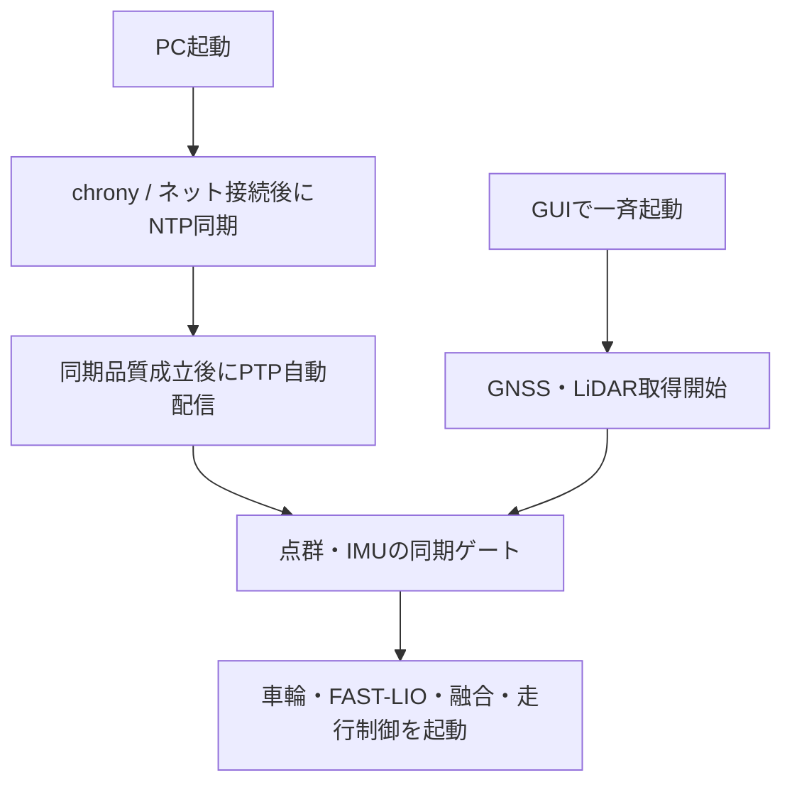

# GNSS・PC・MID360・FAST-LIOの時刻同期

PCは外部NTPに同期し、PCからsoftware PTPでMID360へ時刻を配信する。
GNSSは受信機の測定UTCをメッセージに保持する。USB到着時刻はPC時計の基準に使わない。

ネット接続後のNTP同期とPTP配信はGUI操作なしで進む。
データ取得中のMID360にもPTP同期は有効。同期前のデータを位置推定へ使わないよう、後段の起動を待つ。
共通GUI起動は最大180秒待機する。未成立なら起動を中止し、条件成立後に利用者が再起動する。

GNSSはGGAの測定時刻とRMCの日付を使用する。
共通起動ではgnss_utc、transport_delay_ms=0、time_sync.enabled=trueを指定する。
chronyへのRMC入力はnoselect。FAST-LIOとGNSSの融合は測定時刻順の0.35秒バッファを使用する。

微小逆行は0.1 msまで許容して記録し、原時刻は書き換えない。
大きな逆行・PTP種別不成立・パケット途絶・PC同期品質不成立を監視する。
運用中の同期条件喪失で共通スタックは終了し、同期復旧後の走行系再開には利用者の操作が必要。
GUIは実機モードの全タブ上部に同期未成立・喪失を警告し、正常復帰で消す。

詳細な設定値、初回導入、確認コマンド、精度の限界は
[時刻同期と確認手順](../src/rtk_gps_um982/docs/PTP試験手順.md)を参照する。
