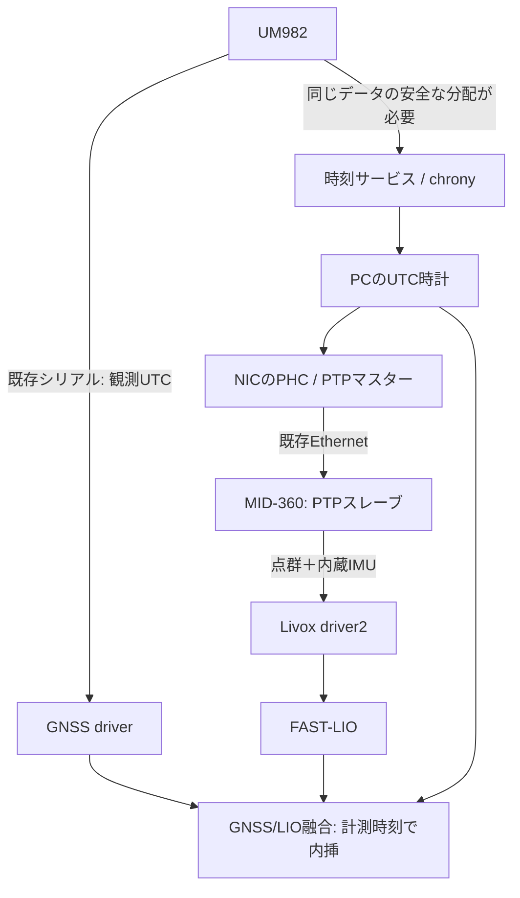

# UM982・MID-360・FAST-LIO 時刻同期提案

調査日: 2026-09-14。資料とソースコードの調査に基づく提案であり、実機設定・配線・同期精度は未検証。
対象は MID-360（MID-360S や旧 Mid-40/70 とは区別する）。

## 1. 推奨構成

現状の MID-360 の配線は Ethernet と電源のみである。
追加配線を避けるため、**GNSSでPC時計を同期し、PCからPTPでMID-360へ配信する方式**を
第一候補とする。Ethernetと電源だけで構成できるが、ケーブル接続だけで同期が完了するわけではない。
GNSS→PCの精度が全体の精度を制限する。NMEA/USBだけで目標を満たすかは測定して判断する。



| 方式 | 適用判断 | 条件 |
| --- | --- | --- |
| GNSSで同期したPCをPTPマスターにする | 既存配線を活かす第一候補 | GNSS→PCの時刻配信とPTP設定が必要。精度を実測する |
| UM982のPPSをPCの対応入力に追加し、PTP配信 | PC同期精度が不足する場合 | PPS入力対応ハードウェアと日付・秒番号の入力が必要 |
| PPS＋UART RMCをMID-360へ直接入力 | 直接同期を優先する追加配線案 | 基板のPPS・空きUARTとMID-360機能ケーブルを使用 |
| PPS＋PC経由UDP時刻通知 | UARTを取り出せない場合の候補 | 最新PPSと対応した時刻を通知する実装が必要 |
| PC受信時刻や固定オフセットのみ | 初期調査に限定 | 通信遅延・ジッタを計測時刻と混同するため本番同期の代替にしない |

この作業PCの読み取り調査では `enp0s31f6` / `e1000e` がハードウェア送受信
タイムスタンプに対応し、PTP Hardware Clock は0だった。調査時はNO-CARRIERであり、
MID-360とのPTP同期は未確認。実機で別PC/別NICを使う場合は再確認する。
`ptp4l` と `chronyc` は調査時のPATHにはなかった。

基板の提示URLは [AliExpress商品1005010071697174](https://www.aliexpress.com/item/1005010071697174.html)。
商品本文は取得できず、基板名・端子仕様・選択バリエーションは未確認である。
以下のピン情報はUM982モジュールの仕様であり、この市販基板での取り出し口は未確定とする。

根拠: [Livox公式同期手順](https://livox-wiki-en.readthedocs.io/en/latest/tutorials/new_product/common/time_sync.html)。

## 2. 追加配線する場合の設定案

MID-360 の User Manual 印刷p.7（PDF 9ページ）、UM982 User Manual 印刷p.8
（PDF 13ページ）、N4コマンド集 §4.3 印刷pp.21–22（PDF 35–36ページ）を参照する。
UM982のモジュール端子番号と市販基板のコネクタ番号は同一とは限らない。

| 接続元 | MID-360 M12端子 | 純正分岐ケーブルの色 |
| --- | --- | --- |
| UM982基板のPPS出力（モジュールではpin 30） | pin 8、3.3V LVTTL入力 | 紫/白 |
| UM982の専用UART TX（COM2等） | pin 10、3.3V LVTTL GPS入力 | 灰/白 |
| 信号GND | pin 2/3に接続する機能ケーブルGND | 黒 |

3.3V信号であることを基板仕様で確認する。RS-232や5V UARTは直接接続せず、
適切なレベル変換を挟む。電源9–27V線と信号入力を混同しない。
色だけで判断せず、使用ケーブルの端子表と導通で照合する。

COM2を専用出力にできる場合の設定候補（まだ送信していない）:

```text
CONFIG COM2 9600 8 n 1
GPRMC COM2 1
CONFIG PPS ENABLE GPS POSITIVE 100000 1000 0 0
```

- COM2: 9600 baud、8 data bits、no parity、1 stop bit。RMCを1Hzで出力する。
- PPS: 正極性、幅100000μs=100ms、周期1000ms=1Hz。RF/User遅延は初期値0。
- PPSのGPS時系指定は秒境界の基準であり、ROS timestampにGPSTの秒数を入れる指示ではない。
  RMCの時刻・日付はUTCである。NMEA UTCへGPS-UTC閏秒を重ねて補正しない。
- 専用COMに既存の高頻度ログが残らないよう出力一覧を確認する。
  全ポートに及ぶ一括ログ停止を盲目的に実行しない。PC側は別COMで既存の測位出力を維持する。
- RMCが直前PPSの秒を示すことを確認する。Livox推奨はPPS後0–430msでRMC送信開始、
  パルス幅10–200msであり、上記100ms幅はその範囲に入る。
- N4のENABLEでは測位とPPS収束後に出力し、衛星喪失後も約30秒維持する場合がある。
  パルスの存在だけをUTC有効・RTK FIXの証拠にしない。ENABLE3の無条件出力は初期案にしない。
- まず一時設定で応答と出力を確認し、使用ファームウェアで動作確認後に保存する。

LivoxのPTPはGPS同期より優先される。GPS直接同期を検証するときは、同じネットワークに
意図しないPTPマスターを置かない。

## 3. 現コードで確認した時刻の流れと不足

| 対象 | 現状 | 必要な対応案 |
| --- | --- | --- |
| UM982 `nmea.py:nmea_utc_to_unix` | GGAには日付がなく、PC時刻に最も近い日を選択 | 有効なRMC/ZDAの日付とGGA時分秒を関連付ける。日付未確定は融合入力にしない |
| UM982 `client.py:get_position` | GGAのtimestampに、その時点で最新のUNIHEADINGを混ぜる | 位置・方位それぞれの計測時刻を保持し、同一epochで結合。古い方位は無効化する |
| UM982 `converters.py:make_stamp` | `gnss_utc`に`transport_delay_ms`を加算 | 原則0。GNSS計測時刻から通信遅延を引くと誤補正になる |
| 同 `pps_edge` | 現状は`clock.now()`へフォールバック | PPS実装済みと扱わない。未対応設定は明示的に拒否する実装を検討 |
| Livox `pub_handler.cpp:GetEthPacketTimestamp` | 同期種別1/2は機器timestampを保持。未同期はホスト時計へフォールバック | パケットの同期種別を別途監視。stampが現在日時に見えても同期済みとは判断しない |
| FAST-LIO `laserMapping.cpp` | 出力Odometry/TFは`lidar_end_time`。IMU同期設定はLiDAR対IMUの補正 | 同期済みMID-360内蔵IMUでは`common.time_sync_en=false`、`common.time_offset_lidar_to_imu=0.0`を初期値とする |
| GNSS/LIO `fusion_node.py` | GNSS時刻にLIOを内挿。fix/statusは同一stampが必要 | 各観測の時刻を正しく付けることが前提。同期フィルタの許容幅を広げて時計ずれを隠さない |
| 同 `tick` | `now-buffer_s`（既定0.35秒）でイベントを処理、nowとの差で鮮度判定 | PC時計の同期が必要。遅延分布を測りバッファを調整。未来stamp・時刻飛びを検知する |

参照ソース:

- `src/rtk_gps_um982/third_party/UM982-RTK-GPS-Library/um982/{nmea,client}.py`
- `src/rtk_gps_um982/rtk_gps_um982/{driver_node,converters}.py`
- `src/livox_ros_driver2/src/comm/pub_handler.cpp`、`src/livox_ros_driver2/src/lddc.cpp`
- `src/FAST_LIO/src/laserMapping.cpp`
- `src/gnss_lio_fusion/gnss_lio_fusion/fusion_node.py`

`common.time_sync_en=true` はGPSとFAST-LIOの時刻同期を行うスイッチではない。
UM982のheading用Imuメッセージには加速度・角速度がなく、FAST-LIOのIMU入力には使わない。
MID-360内蔵IMUを使い、点群のtimebase/点ごとのoffset_timeを保持する。
点群先頭stampとFAST-LIOの走査終端stampが違うこと自体は異常ではない。

## 4. 第一候補のPC時計・PTP構成

配線を維持する案では既存シリアルを単独所有する処理からNMEAを安全に分配し、chronyへ渡す
仕組みを追加する。現driverにはこの配信機能がない。空きCOMを追加できる場合は、
別COM（例COM3）でRMC/ZDAをgpsdへ渡す構成も選べる。
可能なら適切なPPS入力装置でPCにもPPSを分配する。通常のUSBシリアルの受信タイミングを
高精度PPSとみなさない。基板のファンアウト能力・入力方式は別途確認する。
空きCOMがなければ、受信ポートを単独所有するサービスがROS/gpsdへ配信する構成を設計する。
2プロセスによる同一ttyの直接読み取りや単なる2本のsocatは、確実な複製を保証しない。

`chronyc sources -v` の選択済み`*`と`chronyc tracking`のoffset/Leap statusを確認する。
`#? GPS`は同期成功ではない。NMEAのみの精度は受信機・USB・負荷によって変わり、
±30–50msやμs精度を未測定のまま保証しない。

PTP案では「UM982 → PCのUTC → NICのPHC/マスター → MID-360」を一方向に構成する。
MID-360はPTPスレーブであり、PC用の時刻マスターにはしない。
`ethtool -T <NIC>`でハードウェア対応を調査し、PTPの時系とUTC/TAI差を確認する。
PHCとシステム時計の同期方向を逆にしない。`phc2sys -O 0`や固定の閏秒値を
環境確認なしで適用しない。時計を複数のサーボで同時に制御しない。
根拠: [chronyc](https://chrony-project.org/doc/4.6/chronyc.html)、
[phc2sys](https://www.linuxptp.org/documentation/phc2sys/)。

実機では`use_sim_time=false`。シミュレーション・bag再生では全ノードの`/clock`を統一し、
実時刻と混在させない。システム時計のstepは起動前に完了させる。

## 5. 検証・実装の順序

1. UM982基板型番、端子電圧、空きCOM、MID-360ケーブル、ファームウェア、PC NICを確認する。
2. PCのUTC同期とPTPマスターを構成し、静止状態で検証する。追加配線案ではPPS/RMCの
   周期・パルス幅・対応秒・日付・有効フラグも確認する。
3. MID-360の生UDPの`time_type`（SDKではtimestamp_type）を記録する。
   GPS案は2、PTP案は1を期待し、0を見逃さない。ViewerのSync Typeも確認する。
4. `/livox/lidar`、`/livox/imu`、FAST-LIO Odometry、GNSS fix/statusについて
   header stamp・受信時刻・同期状態を同時記録する。実際のtopic名はlaunchに合わせる。
5. GGAの日付確定、位置/方位epoch結合、未同期入力の拒否と状態通知を実装する。
6. 冷間起動、UTC日付跨ぎ、PC時計不正、PPS/RMCの個別断、PTP優先への切替、再同期、
   遅延・順序逆転・重複、古いUNIHEADING、閏秒情報更新を回帰テストにする。
7. シミュレーション/既存bagで既知の10/50/100msずれを注入し、検知・拒否・復帰を確認する。

受入目標案: センサ計測時刻のずれ10ms以内を初期目標とし、必要に応じ1ms以内へ詰める。
これはメーカー保証ではない。1m/sなら10msで1cm、100msで10cmの位置差となる。
旋回では角速度×時刻差の方位差が出る。通信遅延は別にp50/p95/p99を測り、
既定0.35秒の融合バッファに収まるか評価する。受信時刻差だけでは同期精度を証明できない。
時刻不正中は融合への採用を止め、復帰時に履歴をリセットする方針とする（追加実装）。

今回の範囲は資料保存・設計提案・既存説明の訂正である。
センサ設定、OS時刻設定、ドライバ実装、実機動作の変更は行っていない。

## 6. 原典

保存資料の版・取得元・SHA-256は[参照資料一覧](references/README.md)を参照する。
UM982資料は添付原本を変更せず保存した。MID-360資料は公式配布元から取得した。
