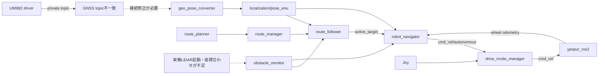

# つくばチャレンジ2026 必須課題完走に向けた現状評価

最新の大会条件は[公式情報参照ガイド](references/tsukuba_challenge_2026/README.md)（2026-09-22確認）を参照。以下の評価は記載日時点の記録。

- 調査日: 2026-09-13
- 対象: `main` の `2a03c65`、Git 管理下の17パッケージ、および手元の未統合作業
- 目標: 選択課題より必須課題の完走を優先する
- 文書種別: 実装調査・開発優先順位の提案。詳細設計や実機性能の認定ではない

## 0. 2026-09-14 の統合状態

以下の1〜10章は **2026-09-13、`2a03c65` 時点の評価記録** として保持する。
章中の「現在」「未統合」「不足」は当該時点を指し、最新の実装状況とは区別する。

- FAST-LIO・Livox driver・SDK は固定 submodule と vendor パッケージで管理する。
  ルートの `colcon.meta` で SDK → driver → FAST-LIO のビルド順を指定する。
- [GNSS/LIO融合](../src/gnss_lio_fusion/README.md)、
  [実機・模擬の共通起動](../src/icart_bringup/README.md)、
  [経路採取・編集](../src/route_survey/README.md)を追加した。
- navigator は pose・odom の受信途絶時にゼロ速度を出し、制御状態をリセットする。
  無効な GNSS 状態は融合の位置・方位の補正に使用しない。
- [デジタルツイン経路](../src/route_planner/routes/tsukuba2026_digital_twin/README.md)は
  検証用データであり、現地確認済みの本番経路ではない。

統合検証は ROS 2 Jazzy と `--system-site-packages` の venv で行った。
Qt WebEngine・pytest-forked・Shapely はローカル依存環境を有効化した。
`pytest -q` は556件成功、CSV改行統一後の採取・共通起動テストは23件成功した。
`colcon test --packages-select obstacle_route_sim` は11テスト群すべて成功した。
SDK・driver・FAST-LIO と変更対象パッケージは symlink install と通常 install の両方で
ビルド成功した。通常 install は別の build/install base で検証した。
上流 CMake/C++ の警告と既存 Qt テストの fork 警告は残る。

実機・Gazeboの走行試験、センサ校正、現地コース適合性はこの統合検証の対象外とする。
過去のシミュレーション評価結果は各パッケージの検証記録を参照する。

## 1. 判断

**経路を読み、目標を更新し、速度指令を生成して監視する骨格はできている。
しかし、現在の `main` をそのまま起動して2026年コースを安定して完走できるとは判断できない。**

主な不足は以下の6点である。

1. 実機向け変更の統合と、ソース・install・設定の一致。
2. GNSS、LiDAR、車体制御を実際につなぐ起動構成。
3. 入力途絶・品質劣化・異常状態に対して、速度指令を確実に止める仕組み。
4. GNSS劣化区間でも車体位置と向きを維持する自己位置推定。
5. 車体全体を考慮した停止、路側境界内の回避、待機列での追従待機。
6. 2026年の経路・停止地点と、現地の走行記録に基づく受け入れ確認。

新しい認識機能を増やすことより、これらを順に閉じる方が完走へ近い。
既存 route stack の全面置換や、最初から全機能をNav2へ移すことを前提にしない。

### 状態の読み方

- **実装あり**: ソースに処理が存在する。実機で成立したという意味ではない。
- **今回確認**: 本調査で実行した単体テスト・静的検査・ROS非依存の再現で確認した。
- **既存記録**: READMEや過去の作業記録に記載されている。今回の再検証ではない。
- **不足**: 必要な接続・処理がない、または具体的な不整合を確認した。
- **未確認**: ハードウェアや現地データが必要で、今回の資料からは判定できない。

## 2. 2026年度の目標との対応

必須課題は約2.2 kmの自律走行であり、確認走行区間は約400 mである。
一時停止と再開、横断歩道での待機列、ホテル周辺の周回、全車体がゴールを越えた後の
停止を含む。選択課題Bを実施しない場合、横断開始はオペレータの安全判断と操作でよい。
経路封鎖迂回の選択課題Cは2026年度には実施されない。
[公式課題](https://tsukubachallenge.jp/2026/regulations/tasks)

停止線と道路端では要求される停止領域が異なり、車体の一部・全体の位置が判定対象になる。
車体中心がwaypointへ近づいたという判定だけで合格を保証できない。
待機列では追い越さず、空間が空けば前進する必要がある。
また、ホテル西側の朱色路側帯で通過不能な場合は専用の退避手順が定められているため、
どこでも自動的に横へ回り込む方針にはしない。
[公式課題](https://tsukubachallenge.jp/2026/regulations/tasks)

評価上は完走と「課題達成」は異なる。後者には選択課題の成功も必要だが、今回は完走を目標とする。
制限時間は全体100分、発進時は1分以内にスタートライン・2分以内に20 mを越える。
確認区間の長時間停滞や、待機列が空いているのに進まないことも失敗条件となる。
一般の走行中に操縦で修正してよいという意味ではなく、許された再開操作と手動介入を区別する。
[公式評価方法](https://tsukubachallenge.jp/2026/regulations/evaluation)

最高速度制限は6 km/hであり、誤動作時にも超えない構成が求められる。
物理非常停止とコントローラ操作による停止は別扱いである。車体寸法、非常停止回路、
制動・退避方法の適合性は、ソフトウェアの存在だけでは判断できない。
[公式ロボット仕様](https://tsukubachallenge.jp/2026/regulations/specs)

## 3. ワークスペースで現在できること

| 領域・パッケージ | 現在の実装 | 完走へ向けた評価 |
| --- | --- | --- |
| `rtk_gps_um982` / `rtk_gps_um982_msgs` | UM982通信、NTRIP、位置・方位・RTK品質の配信 | GNSS入力の部品はある。後段とのtopic不一致、品質と時刻の扱いを修正する必要がある |
| `geo_pose_converter` / `tc_geo_msgs` | LLH/ENU、heading変換、投影情報、地図向けLLH出力 | 座標変換は実装済み。センサ融合、車体中心への補正、異常時の走行許可判定は別途必要 |
| `route_planner` / `tc_route_msgs` | YAML/CSV、固定経路、グラフ経路、開始・終了label、可変区間再探索、停止属性 | 経路表現の基盤を利用できる。2026年コースへの照合と運用モード属性が不足 |
| `route_manager` | active route配信、状態管理、滞留報告に応じたSHIFT/SKIP/再探索 | リルートの骨格はある。道路境界・停止必須地点・復帰操作の保証が必要 |
| `route_follower` | waypoint更新、停止待ち、manual_start、信号GO、滞留検出、L字回避、経路復帰 | 単純な経路追従は可能。位置鮮度、回避幅の境界値、車体の停止判定が不足 |
| `robot_navigator` | 目標方向制御、速度・加速制限、障害物距離による減速停止 | 有効な入力が継続する条件で速度指令を作れる。入力途絶後の継続出力が重大な問題 |
| `obstacle_monitor` | 2D LaserScanから前方距離・閉塞・左右オフセット・画像を生成 | 前方障害物の基本判定がある。欠測と空間の空きを区別できず、旋回・側後方・境界の保証がない |
| `drive_mode_manager` | 自律/手動mux、デッドマン、指令timeout、自律復帰待ち、状態GUI | 操作切替の骨格はある。実機ボタン割当が別ブランチ、健康状態と連動する最終停止制御が不足 |
| `ypspur_ros2` | coordinator連携、速度上限、指令timeout、wheel odometry | 車体駆動境界は実装済み。通信失敗の扱い、非常停止系、実車性能を確認する必要がある |
| `yolo_detector` | PyTorch/NCNN推論、画像・Detection2DArray | 認識共通基盤とモデル資産がある。実カメラ接続・対象別認識性能の証明は未確認 |
| `traffic_signal_recognizer` | 検出結果の連続青判定、GO/STOP、recog_flag連携 | 信号判定はある。横断歩道内の残留車両判定等は別途必要。必須完走の開発優先度は下げる |
| `road_blockage_detector` | 検出履歴・位置による封鎖判定、多重検知抑止 | 封鎖認識を実装済み。2026年必須完走の追加開発対象から外せる |
| `robot_console` | PyQt5、HTML観測、地図、起動プリセット、ログ、状態、再開操作 | 運用UIは大きく進んだ。安全監視装置の代替ではなく、未接続基盤や一部未実装表示が残る |
| `obstacle_route_sim` | Gazebo道路、LiDAR、障害物、真値による自己位置 | 経路・回避の結合試験基盤がある。実測位の劣化や実機の制動を再現した証明ではない |

`obstacle_route_sim/README.md` の既存確認記録は、主に幅5 mの直線・S字・クランクと
代表的な回避ケースである。幅2/3 mの設定があることと、その幅で走行確認が済んだことは異なる。
PR #7にはシミュレーション走行の記録もあるが、実機走行は未実施と記載されている。

### 現在の主な接続



この図の矢印は設計・コード上の接続であり、稼働中のROS graphを観測したものではない。

## 4. 最初に解消する具体的な問題

### 4.1 main・作業ブランチ・installの不一致

`feature/joy-real-button-mapping` には、`main` に未統合の5コミットが存在する。
実機Joy対応、LiDAR導入、過去の不足システム調査などを含む。

- `main` のGit管理対象は17パッケージ。
- FAST_LIO、Livox driver、Livox SDK vendorに関する3ディレクトリは手元に残るが、
  現在の `main` では未追跡である。
- 当該ブランチの資料では、Mid-360、Top-URG（UTM-30LX）、FAST_LIOを想定する。
  Top-URG driverはapt導入方針であり、独自パッケージがないことだけでdriver不在とは判断しない。
- `main` のモード切替ボタンはindex 16だが、実機対応ブランチではindex 5を使用する。
- 本調査で通常のinstallを読み込んだテストは148件成功・2件失敗。
  import先がinstall内の別実装で、ボタンindexが5であることを確認した。
  現在のsrcを明示した再実行では150件成功した。

したがって、テストの2件失敗をただちにmainソースの不具合とは判定しない。
一方、ソース更新だけでは現在の実行内容が一致しないという問題は実在する。
未統合変更をレビューして取り込み、クリーンなビルドから再現する作業を最初に行う。
本調査ではブランチ統合や生成物の削除は行っていない。

### 4.2 GNSS topicが既定値で接続しない

`rtk_gps_um982/driver_node.py` は `~/fix`、`~/heading`、`~/rtk_status` をpublishする。
launchのnamespaceは `rtk_gps`、node nameは `rtk_gps_um982_node` である。
ROSの名前展開関数で、fix配信先が次になることを確認した。

```text
配信: /rtk_gps/rtk_gps_um982_node/fix
購読: /rtk_gps/fix
```

headingとstatusにも同じ階層差がある。座標変換側のlaunchに、この差を吸収するremapはない。
GUIの実機プリセットはGNSSとconverterを選択し、converterを有効化する実装になっているが、
ノードを起動するだけではこの不一致を解消しない。

**必要な対応:** 正式topic名を一つに決め、driver・converter・GUI health・資料・接続テストをそろえる。
起動後に「ノードが存在する」だけでなく、有効なposeが流れることを走行開始条件にする。

### 4.3 入力が止まっても新しい速度指令を出せる

`robot_navigator` の `on_pose_enu()`、`on_odom()` は値を保存し、`on_timer()` は
pose・velocity・goalが存在するかを確認する。最終受信時刻や測定時刻の期限は確認しない。
障害物hintも受信値を保持し、初回未受信や途絶を走行禁止理由にしていない。

そのため、走行中にGNSS・odom・障害物入力が止まった場合、古い値から制御を継続し得る。
muxやypspurのcmd timeoutは、navigatorが指令を周期送信している限り作動しない。
また、navigatorはfollowerのERRORや待機状態を直接購読して走行許可を判定していない。

**必要な対応:** 入力ごとの受信鮮度・測定時刻・有限値・frame・品質を検査する。
目標topicは同じ指令の再送でstampを変えない仕様なので、指令識別stampと通信heartbeatを
混同しない。異常を検出した場合は最終速度出力まで停止が伝わる契約を作る。
GUIのSTALE表示だけでは対策にならない。

### 4.4 回避幅の上限を超える境界値がある

`FollowerCore._start_avoidance_sequence()` の `pick_offset()` は、waypoint側の上限が
最小回避幅より小さい場合にも、最小回避幅へ切り上げる。
純Pythonの呼び出しで次を再現した。

```text
left_open = 0.10 m, hint left = 0.10 m, right_open = 0
生成された横方向回避幅 = 0.35 m
```

路側が0.10 mしか開いていないという設定を守れないため、狭い歩道では先に修正する必要がある。
許される幅より必要幅が大きければ「回避不可」とし、待機や別の許可済み処理へ移るべきである。
これは今回の調査で再現した問題であり、修正は本調査の範囲に含めていない。

### 4.5 GNSS poseは安定した車体poseと同義ではない

converterは最新のRtkStatusを保持し、statusを一度受信したことを方位有効性の判定に使っている。
fixとstatusの時刻差、方位の欠落、RTK劣化を走行可否に反映する処理はない。
`/heading` を保持するが、ENU生成は主にstatus内のraw headingを使う。
driverはheading欠落時にもstatusのheadingを0として表現し得るため、
「0度は有効な方位」と「方位がない」を値だけで区別できない。

また、既定のchild frameは `gps_link` である。
アンテナ位置から車体基準点へのレバーアーム補正がなく、navigatorは入力poseを走行基準として使う。
停止線ではアンテナ位置・車軸中心・車体前端の差を無視できない。

**必要な対応:** 同期・品質・方位有効性・外部キャリブレーションを明示し、
走行側へは車体基準のposeを渡す。単なるLLH/ENU変換をlocalization fusionと呼ばない。

### 4.6 障害物距離の意味と実際の検出範囲

`obstacle_monitor` は既定で前方1.5 mまでの点を抽出する。
`hint_range_m=5.0` でも、現在の抽出処理のまま5 m先まで検知するわけではない。
近距離0.2 m未満と後方の点は除外し、空点群・最小点数未満は `front_blocked=False`、
距離無限大として出力する。センサ欠測と「障害物がない」を分ける品質情報が必要である。

scan座標をそのまま車体座標として計算し、hintのframeを `base_link` としている。
LiDARの取付位置・向きが異なる場合は、TFを用意するだけでなく、点の変換を実際に適用する必要がある。
現在の前方帯とL字サブゴールでは、旋回中の車体外周、後側、歩道の段差・落差まで保証できない。

## 5. 完走に必要な能力と不足の扱い

### 5.1 自己位置推定

GNSSが良好な場所での低速試験は、配線と品質検査を直せば既存converterを活用できる。
ただし、建物・樹木などの影響は実際のコースで測る必要があり、RTK FIX表記だけでは
停止精度や横偏差の保証にはならない。

推奨する段階導入は以下である。

1. GNSSとwheel odometryの時刻・向き・基準点を整合させ、品質とジャンプを監視する。
2. GNSS劣化時の予測・停止・復帰を設計する。復帰時の位置ジャンプで急旋回させない。
3. 実測した劣化時間・誤差が走行余裕を超える区間に、Mid-360/FAST_LIO等を統合する。
4. LIOの局所座標をENUへ整合させ、長距離ドリフトと再初期化を検証する。

FAST_LIOは名前やビルド成功だけで地理座標上の絶対位置を提供するものではない。
一方、GNSSとwheelで必要性能を満たせる区間にまで、最初からLIOを必須化する必要もない。
選定基準はコース上での誤差・継続性・復帰性能とする。

### 5.2 停止線・道路端・ゴール

停止属性とmanual_startによる再開は実装済みである。
しかし、followerの到達閾値は0.6 m、navigatorの位置許容は0.5 mであり、同一の停止仕様ではない。
navigatorは目標距離による連続的な減速より、許容範囲内に入ったときのゼロ指令を使う。
followerのWAITING_STOPは実測速度ゼロや停止保持時間の確認結果ではない。

必要な追加設計:

- 通過waypointと停止waypointで、到達判定・減速・向き合わせを分ける。
- 車体寸法、アンテナオフセット、測位誤差、制動距離を含めて停止目標を配置する。
- 停止成立を位置だけでなく実測速度と保持時間で確認してから再開を受け付ける。
- ゴールは車体後端も通過する目標位置にする。
- line_stop/signal_stopと、待機列先頭/道路端の二段階停止を2026年routeへ落とし込む。

停止設計の目安は、制御基準点からの残距離に対して
`v × 遅延 + v² / (2 × 実測最小減速度) + 車体前端オフセット + 縦位置誤差 + 余裕`
を考慮することである。閾値は実車の荷重・路面・速度ごとの測定結果から決める。

### 5.3 障害物・歩行者・待機列

現在は「前方距離で減速停止し、滞留が続けば横方向の回避目標を作る」構造である。
動く対象の追跡・予測や待機列専用状態は確認できない。
障害物で止まれることと、人や車道へ接近せずに回避できることを分けて試験する。

- 待機列、道路端、狭い区間では、追い越しや横回避を禁止する運用モードが必要である。
- 移動する歩行者には、まず減速・停止・通過待ちを成立させる。
  「歩行者分類用AIが必須」とはしないが、人の横切りに間に合う検出・停止性能を実測する。
- 静止コーンには、幅と経路の通行可能範囲を満たす場合だけ回避する。
- 回避サブゴールの点だけでなく、そこへ移動・旋回する間の車体占有領域を確認する。
- routeのleft/right_openを走行禁止境界の厳密な代替としない。
  車幅・姿勢・測位誤差・制御横偏差を含む通行可能な帯を定義する。

Top-URGを前方障害物用、Mid-360を自己位置用に分担できるなら、Mid-360からscanを作る
adapterを最初の必須タスクにする必要はない。Top-URGの死角・高さで不足する検知能力を
現物で確認し、点群や複数センサの追加要否を決める。

### 5.4 最終速度出力と発進許可

現在のcmd timeoutと手動デッドマンは利用する。その前提で、以下を追加する。

- 有効な自己位置、障害物監視、車体driver、経路状態がそろうまでは自律指令を許可しない。
- `ERROR`、センサ途絶、時刻異常、route/frame不一致時の停止と復帰条件を定義する。
- 自律復帰の5秒待ちだけで健全性を保証しない。異常停止からの復帰は明示確認を要求する。
- 最終 `/cmd_vel` は一つの経路に統一する。navigatorの単独launch既定は `/cmd_vel` なので、
  GUIプリセットの `/cmd_vel/autonomous` と混在させない。
- speed上限を設定間で一致させる。既定の手動ターボ指令は1.8 m/s、navigatorは1.1 m/s、
  ypspur側は1.0 m/sである。通常構成では最終driverが制限するが、表示・予測との不整合がある。
- ypspurの位置・速度取得APIの失敗を処理し、失敗時に新しいstampのodomを正常値として出さない。

物理非常停止の有無・配線・制動性能は未確認であり、「未実装」と断定しない。
ソフトのtimeoutはプロセス自体が停止した場合に実行できないので、車体側の停止機構も確認する。

### 5.5 2026年専用の経路と起動構成

`routes/tsukuba/route_config*.yaml` には `20251018`、`20251206` というブロック名がある。
2026年度公式経路との一致を示す資料は今回確認できなかった。
既存CSVは利用可能な資産だが、そのまま本番用と見なさない。

| 固定CSV | 点数 | 緯度経度の隣接点から求めた概算距離 |
| --- | ---: | ---: |
| `fixed_first.csv` | 233 | 779 m |
| `fixed_park.csv` | 120 | 438 m |
| `fixed_park2goal.csv` | 424 | 1,373 m |
| `fixed_second.csv` | 271 | 899 m |

距離は局所平面近似による検算値であり、グラフ経路・ブロック接続・実走行軌跡の総距離ではない。
約2 kmのデータがあることだけではコース適合の根拠にならない。

必要な成果物は、2026年の経路、停止地点、待機列、回避禁止区間、速度上限、
左右スタートへの対応、ゴール停止点を対応付けた表と、実機用の単一起動profileである。
専用bringupは、単にNodeを列挙するだけでなく、topic・frame・設定と起動準備の検査を担う。
信号認識・封鎖認識は必須完走用profileでは選択外にし、意図しないGOや封鎖判定を混ぜない。

`route_manager/params/tsukuba_all_fixed*.yaml` のルートキーが `froute_manager` である点も
確認した。既定ノード名 `route_manager` へ読み込ませる構成では設定が適用されないため、
本番profileの作成時に修正・検証する。

### 5.6 長時間運用と記録

GUIログとCSVログはあるが、完走判定・原因分析に必要な統一走行記録の運用は不足する。
少なくともpose・品質・odom・scan・経路・目標・指令・モード・再開操作を同じ時刻軸で記録する。
ソースcommit、route版、設定、センサ取付値も走行記録へ紐付ける。

本番相当のPC・電源・通信・センサ構成で、バッテリー、CPU温度、処理遅延、
ログ容量、通信断、雨滴や照明変化の影響を確認する。
Web地図の外部タイル接続がなくても、制御と必要な状態表示を継続できる構成にする。

100分に対する時間配分の目安を、停止なし2,200 mとして計算すると以下となる。
これは推奨走行速度や安全性能の保証ではない。

| 移動中の平均速度 | 移動時間 | 待機・停止に残る時間 |
| --- | ---: | ---: |
| 0.5 m/s | 約73分 | 約27分 |
| 0.7 m/s | 約52分 | 約48分 |
| 1.0 m/s | 約37分 | 約63分 |

低速化だけで解決しようとせず、停止精度と停滞からの復帰を両立させる。
横断中の通過時間は、前後の待機時間と分けて測る。

## 6. 開発タスクの優先順位と受け入れ条件

優先度は新たに本目標向けに定義する。過去資料のP0/P1番号とは一致しない。

| 優先 | 作業 | 完了とみなす条件 | 主な依存 |
| --- | --- | --- | --- |
| P0-1 | 未統合ブランチの整理と実行環境の再構築 | 新規cloneからdriverを含む同じ構成がビルドでき、import先・Joy設定が一致する | 実機構成の確定 |
| P0-2 | GNSS topic、LiDAR入力、TF/取付値、cmd経路の統合 | 正式topic/frameが一意で、実機profileから有効なpose/scan/odomが得られる | P0-1 |
| P0-3 | 入力健康監視と最終停止 | 各入力の未受信・途絶・古いstamp・NaN・位置ジャンプ・driver障害で規定時間内に止まる | 停止遅延・制動距離の実測 |
| P0-4 | 回避幅上限超過の修正 | 上限が最小回避幅未満なら回避不可。生成経路が設定境界を超えない | 回帰テスト |
| P1-1 | 車体基準の自己位置と劣化対策 | 停止・狭路の誤差予算を満たし、GNSS劣化/復帰で危険な指令を出さない | P0-2/3、現地bag |
| P1-2 | 停止・再開・ゴール判定 | 荷重・速度・進入方向を変えて車体全体が要求領域を守り、再開が一操作で一度だけ成立する | P1-1、車体寸法 |
| P1-3 | 待機/回避モードと境界制約 | 列では追い越さず、静止コーンを許可領域内で処理し、横切りには停止できる | P0-4、検知/制動実測 |
| P1-4 | 2026 route作成・照合 | 全経路、各停止点、横断前後、狭路、スタート・ゴールの現地対応が記録される | 公式図・現地確認 |
| P2-1 | センサ融合の段階導入 | 現地の最悪劣化区間で誤差・復帰性能を満たす | GNSS/wheel評価、必要ならLIO |
| P2-2 | 故障時の運用と走行再開 | 正式な停止・復帰操作が明確で、ERROR復帰時に旧目標へ暴走しない | 状態遷移設計 |
| P2-3 | 本番相当の連続走行 | 時間・電源・温度・ログ容量の余裕を確認し、複数回の全周走行記録がある | P0/P1、現地試験 |

センサ融合は番号上P2でも、現地のGNSS品質が不足すればP1-1を満たすための必須依存になる。
優先順位はその実測で繰り上げる。

## 7. 本走行までの進め方

公式予定では最初の実験走行が9月26日、本走行が12月6日である。
[公式日程](https://tsukubachallenge.jp/2026/about/schedule)

以下は人員・実機稼働率が未確認のため、完了保証ではなく目標とする。

| 時期 | 到達目標 | 持ち帰る証拠 |
| --- | --- | --- |
| 9月26日まで | P0を閉じ、拠点で低速直進・停止・手動切替・入力途絶停止を確認 | 構成一覧、停止距離、接続/異常系テスト |
| 9月26日 | 確認走行区間の実情とGNSS品質を測定。条件がそろえば確認走行へ進む | 経路・停止位置・scan・GNSS品質の記録 |
| 10月3/4/17日 | 確認走行の再現性と、ホテル周辺までの局所課題を解消 | 停止誤差、狭路横偏差、待機列・回避の結果 |
| 11月7日 | 必須全コースを通した試験 | 区間別所要時間、介入・停止・再計画の全履歴 |
| 11月28/29日 | 本番構成を固定して反復する | 完走の再現性、電源/温度/通信の余裕 |
| 12月4/5日 | 当年route・配置差分と運用手順の最終確認 | 固定したcommit/設定/routeと担当分担 |

公式会場での動力走行は指定された実験日・場所と安全チェックの手順に従う。
確認走行達成がその先の自律走行の前提である。
[公式安全事項](https://tsukubachallenge.jp/2026/regulations/safety)

## 8. 今回の確認結果と限界

### 8.1 既存テスト

ROS環境と既存installを読み込んだ後、以下を実行した。

```bash
PYTHONDONTWRITEBYTECODE=1 python3 -m pytest -p no:cacheprovider \
  src/drive_mode_manager/tests src/geo_pose_converter/tests \
  src/route_planner/tests src/traffic_signal_recognizer/tests \
  src/rtk_gps_um982/test src/obstacle_route_sim/tests \
  src/robot_console/tools/tests/test_launch_manager.py \
  src/robot_console/tools/tests/test_console_core.py -q
```

結果は148成功・2失敗。失敗したのはJoyボタン割当の2件で、旧installの読込みを確認した。
srcを優先する以下の方法で再実行した結果は **150成功** である。

```bash
PYTHONDONTWRITEBYTECODE=1 python3 - <<'PY'
from pathlib import Path
import sys
import pytest

roots = [
    p.parent for p in Path('src').glob('*/package.xml')
    if (p.parent / p.parent.name / '__init__.py').exists()
]
sys.path[:0] = [str(p.resolve()) for p in roots]
raise SystemExit(pytest.main([
    '-p', 'no:cacheprovider',
    'src/drive_mode_manager/tests', 'src/geo_pose_converter/tests',
    'src/route_planner/tests', 'src/traffic_signal_recognizer/tests',
    'src/rtk_gps_um982/test', 'src/obstacle_route_sim/tests',
    'src/robot_console/tools/tests/test_launch_manager.py',
    'src/robot_console/tools/tests/test_console_core.py', '-q',
]))
PY
```

この切替は調査用であり、実行環境を修復したことにはならない。
ROS interface等は既存installを使用しており、クリーンビルドの保証でもない。
venv未使用とpytest-forked未導入の警告が出た。GUIを生成するテストは今回の対象に含めていない。

Git管理下の `test_*.py` は7パッケージに44ファイルあり、30ファイルはrobot_consoleにある。
`robot_navigator`、`route_follower`、`route_manager`、`obstacle_monitor` には
同形式のテストファイルを確認できなかった。補助ツールや既存結合記録がないという意味ではないが、
150件成功を制御・障害物処理全体の合格と解釈しない。

### 8.2 小さな再現・静的検査

- `rclpy.expand_topic_name()` でGNSS private topicの名前を確認した。Nodeは起動していない。
- `FollowerCore` の純Python呼出しで0.10 m上限から0.35 m回避幅が生成されることを確認した。
- CSVの点数、概算距離、停止属性を読み取り、経路設定の参照先を確認した。
- 生成した本書のリンク先と `git diff --check` を確認する。

### 8.3 実施していない確認

今回の変更は本レポートの追加のみなので、colcon buildは実施しない。
PR #7対応時のrobot_console両方式のビルド成功は、ワークスペース全体の確認には含めない。
ROSノード起動、実機駆動、センサ接続、GUI、Gazebo、現地試験は実施していない。
バッテリー、物理非常停止、取付寸法、実機走行実績はユーザー確認待ちである。

## 9. 既存文書との違いと参照先

参照した主な既存文書は、ワークスペースREADME、各パッケージREADME、
次期アーキテクチャ検討レポート、GUI構成/画面設計、geo_pose_converter詳細設計、
navigator/obstacle_monitor追加実装検討報告、シミュレーション確認記録である。
加えて、別ブランチにある2026年7月26日版の不足システム資料を `git show` で参照した。

過去資料をそのまま現状のタスクリストとしては使わない。

| 過去資料の記述・見え方 | 今回の整理 |
| --- | --- |
| geo converter、drive mux、認識分離は将来追加 | 現在は実装あり。残件は接続・品質・実機確認 |
| GUIの地図/GNSS表示・起動UIは未着手 | PyQt5/HTMLと実機プリセットは実装済み |
| ypspurの既定odomが不一致 | PR #7でlaunch既定とGUIは統一済み。古い説明を更新する必要がある |
| LiDAR導入完了 | 作業ブランチの記録としては完了だが、現在のmainに未統合 |
| コントローラ停止を安全手段として扱う | 物理非常停止の確認を別に行う。Joy切替だけで代替しない |
| 信号認識・封鎖認識を先に追加する | 必須完走優先なら、接続・停止・測位・境界・待機を先にする |
| robot_console READMEのtkinter説明 | 正式launchのPyQt5と一致しない箇所が残る |

主なコード根拠（行番号は対象commit時点。リンクはファイルへ向ける）:

| 根拠 | 確認箇所 |
| --- | --- |
| [GNSS driver](../src/rtk_gps_um982/rtk_gps_um982/driver_node.py) / [launch](../src/rtk_gps_um982/launch/rtk_gps_um982.launch.py) | private topic、node name、namespace、品質filter |
| [GNSS converter](../src/geo_pose_converter/geo_pose_converter/geo_pose_converter_node.py) | `_on_fix()`、最新status、方位・品質・pose生成 |
| [navigator](../src/robot_navigator/robot_navigator/robot_navigator_node.py) | `on_pose_enu()`、`on_odom()`、`on_hint()`、`on_timer()`、`compute_time_optimal_cmd_vel()` |
| [follower core](../src/route_follower/route_follower/follower_core.py) | `tick()`、WAITING_STOP、`_start_avoidance_sequence()`、復帰処理 |
| [follower node](../src/route_follower/route_follower/route_follower_node.py) | pose・control入力、target再送stamp、recog_flag |
| [manager core](../src/route_manager/route_manager/manager_core.py) / [FSM](../src/route_manager/route_manager/manager_fsm.py) | SHIFT/SKIP/再探索、timeout、状態遷移 |
| [obstacle monitor](../src/obstacle_monitor/obstacle_monitor/obstacle_monitor_node.py) | 点群抽出、`_is_front_blocked()`、座標と品質の扱い |
| [drive core](../src/drive_mode_manager/drive_mode_manager/drive_mode_core.py) / [設定](../src/drive_mode_manager/params/default.yaml) | timeout、mode遷移、ボタン、復帰条件 |
| [ypspur](../src/ypspur_ros2/src/ypspur_node.cpp) | cmd timeout、速度上限、odom取得失敗の扱い |
| [実機プリセット](../src/robot_console/robot_console/core/business_mode.py) / [起動設定](../src/robot_console/config/node_launch_profiles.yaml) | GNSS converter有効化、cmd remap、driver不足 |
| [GUI画面設計](../src/robot_console/docs/robot_console_gui_screen_function_design.md) | 1.1節の未実装表示、実機操作フロー |
| [tsukuba route](../src/route_planner/routes/tsukuba/route_config.yaml) | 年次block、固定/可変経路 |
| [既存アーキテクチャ](次期システム_アーキテクチャ検討レポート.md) | fusion、TF、bringupの方針と実装との差 |
| [シミュレーション記録](../src/obstacle_route_sim/README.md) | 幅5 m代表ケースの既存確認結果 |

## 10. 未確認事項

以下が分かれば、特に自己位置融合の優先度と試験日程を具体化できる。

1. 実際に搭載しているLiDAR、GNSSアンテナ配置、カメラ、PC、車体寸法。
2. 物理非常停止、coordinator/車体側watchdog、手動コントローラの実物確認結果。
3. 実機で自律走行した距離・場所・速度と、その際のbagや失敗現象。
4. 開発担当者数、実験日に参加できる日、現地計測・route作成の担当。
5. GNSS補正通信が使えない場合の運用と、既存の地図・キャリブレーション資産。

## 改版履歴

| 日付 | 版 | 内容 |
| --- | --- | --- |
| 2026-09-13 | 1.0 | main/未統合資産/公式2026課題の照合、150テスト確認、具体的不整合の再現、必須完走向け優先順位を整理 |
