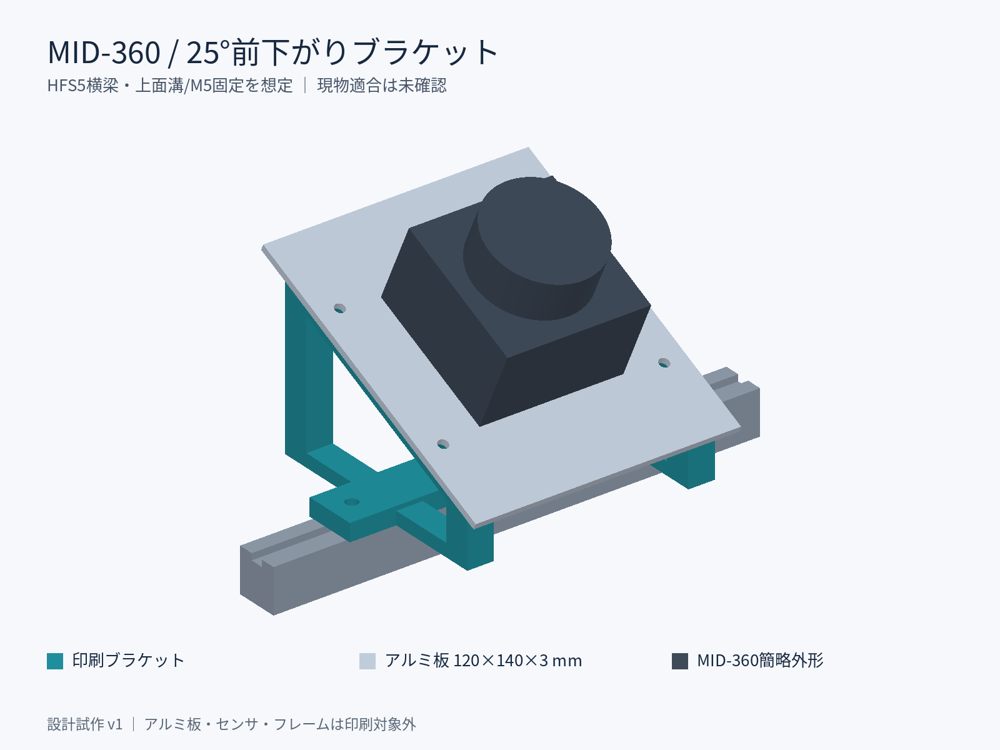
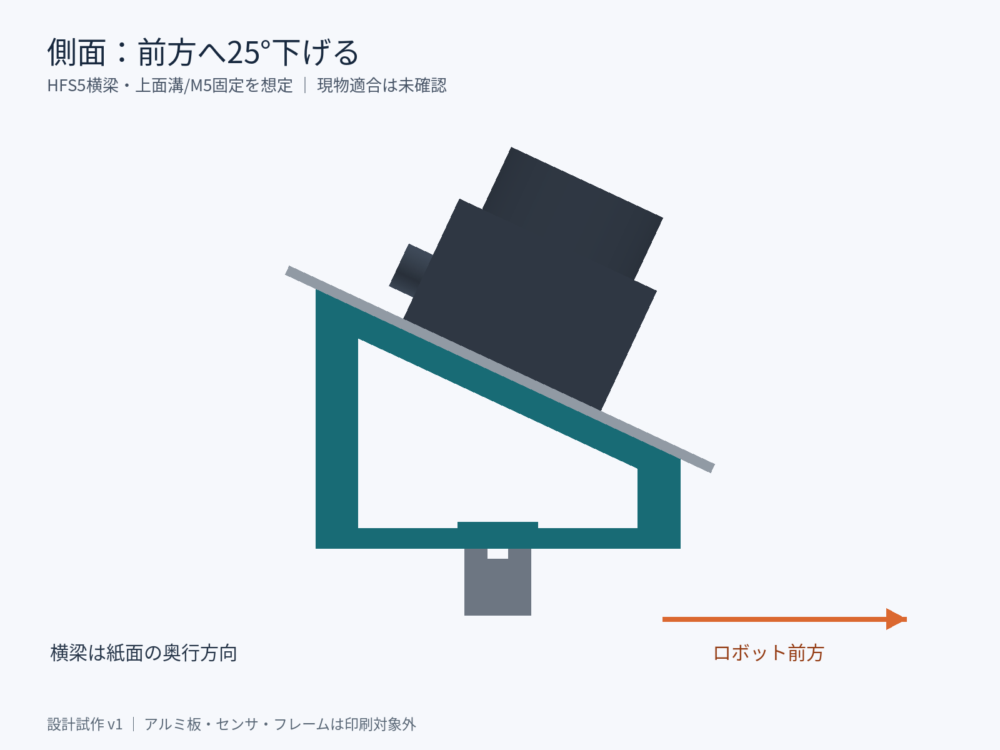
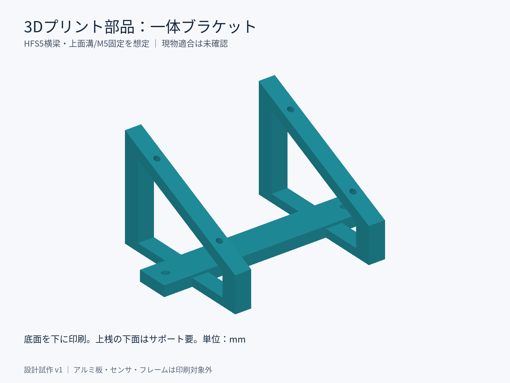

# MID-360 前下がり25°マウント（試作）

ロボット横方向のMISUMI HFS5横梁の**上面溝**へM5ねじ2本で取り付けるブラケットです。
3Dプリントする一体ブラケットと、放熱用アルミ板を組み合わせます。
実機の横梁型番・上面への取付可否は未確認です。現物適合、耐振動、温度試験前の試作モデルです。





## ファイル

| ファイル（exports内） | 用途 |
| --- | --- |
| bracket_25deg.stl | **印刷する部品、1個。単位mm** |
| bracket_25deg.step | ブラケットの編集・加工用CAD |
| aluminum_plate_120x140x3.step | 別途用意するアルミ板。樹脂で代用しない |
| aluminum_plate_drill.dxf | アルミ板の外形・8穴、1:1、mm |
| assembly_reference.step / .stl | 組立参照用。センサと横梁は簡略形状。印刷用ではない |
| assembly.png / side.png / printed_part.png | スマートフォンでの確認用静止画 |
| dimensions.json | 寸法と検証状態 |

物理部品の製造データとして、ROSパッケージと分けて`hardware/`に配置しています。
ローカルのファイルはiPhoneから直接取得できる共有URLではありません。共有先指定後に配信します。

## 寸法と取付前提

座標はX=横梁方向、Y=ロボット前方、Z=上です。センサ取付面はX軸回り−25°。
前方に進むほど取付面が低くなります。このCADの座標系はROSのbase_linkとは異なります。

| 項目 | 寸法 |
| --- | --- |
| 印刷部品の外形（横×前後×高さ） | 約154 × 108.76 × 77.36 mm |
| 横梁に接する中央ベース | 154 × 24 × 8 mm |
| 横梁固定穴 | φ5.5、横方向ピッチ134 mm |
| アルミ板 | 120 × 140 × 3 mm |
| アルミ板とブラケットの固定穴 | φ4.5、横100 × 前後68 mm、4穴 |
| センサ固定穴 | φ3.4、横36 × 前後48 mm、4穴 |
| 印刷部品の体積 | 約86.56 cm³（中実CAD、スライス後の樹脂量とは異なる） |

横梁の上面幅20mm以上、溝中心に沿って134mmの取付ピッチ、幅154mmの空きが必要です。
上面が塞がれている場合、このモデルはそのまま使えません。
HFS5の上面溝を利用するため、フレーム外周を挟む構造ではありません。
横梁の前後にもブラケットと板が張り出すため、周辺機器との干渉を確認してください。

公式i-Cart mini部品表にはHFS5-2020、2040、2060とHNTT5-5が載っています。
これはHFS5/M5採用の根拠であり、今回取り付ける横梁が特定できたことを意味しません。
センサ底面の公式48×36mmパターンを90°回して配置しています。ケーブルを後方へ出す想定ですが、
簡略センサモデルにコネクタの正確な位置・ケーブル曲げ半径は再現していません。

## 部材と組立

| 部材 | 数量 | 備考 |
| --- | --- | --- |
| 印刷ブラケット | 1 | STLを原寸で印刷 |
| アルミ板120×140×3mm | 1 | DXFに従い穴加工・バリ取り |
| M3×8ねじ＋厚さ1mmワッシャー | 各4 | MID-360固定用の候補。板からの突出は約4mm |
| M4×20ねじ、M4ナット | 各4 | アルミ板とブラケットを固定 |
| M4平ワッシャー | 8 | ねじ頭側・ナット側 |
| M5×16ねじ、平ワッシャー | 各2 | 横梁固定用の候補。実物の溝・ナットに合わせる |
| HFS5対応M5 Tナット | 2 | 先入れ品は梁端から入れられる必要あり |

1. アルミ板の外形と穴位置を現物センサ底面に重ねて確認し、加工します。
2. アルミ板の裏からM3ねじでセンサを固定します。メーカー記載のタップ深さは5mmです。
   ねじの実際の突出量を測り、底付きさせないでください。締付トルクはメーカー仕様を優先します。
3. ブラケットを横梁上面へM5で固定します。Tナットの噛み合いとねじの底付きを確認します。
4. センサ付きアルミ板を載せ、M4ねじで固定します。側面の窓からワッシャーとナットを入れます。
   センサ取付ねじは先に締めておきます。組立後は中央ベースが工具経路に干渉します。
5. ケーブルを別途固定してコネクタへ引張荷重を掛けず、周辺との接触を確認します。

## 印刷・実機確認

STLは底面Z=0で、そのまま底面を下にして印刷します。側面窓の上桟にはサポートが必要です。
窓から除去できる設定にし、M4穴・ナット周囲に残さないでください。
試作の出発点は0.2mm積層、外周5～6周、40～60%インフィルです。強度を保証する値ではありません。
屋外試作はPETG、長期使用はプリンタ条件に応じASAやPAを検討し、熱変形しやすいPLAは避けます。
穴の仕上がりとねじ工具のアクセスを仮組みで確認し、樹脂を潰すまで締め込まないでください。

MID-360マニュアルは厚さ3mm以上・露出面積10000mm²以上の平らな金属放熱面を推奨しています。
この板は片面のセンサ占有面積を差し引いた概算で12575mm²（穴面積を除く前）です。
板を傾けると冷却条件も変わるので、面積を満たすだけで温度性能を保証できません。
周囲10mm以上の空間を確保し、屋外連続動作で温度・緩み・振動による点群の乱れを確認してください。

STLの閉じた形状、単一部品、STEPの有効性、外形、穴径・穴位置はソフトウェアで確認しています。
実機取付、耐荷重・疲労、放熱、プリンタでの造形は未検証です。
取付変更後はbase_linkとセンサの外部姿勢を更新してください。MID-360内部のLiDAR–IMU較正値は変更しません。

## 再生成・形状検証

Python仮想環境で以下を実行します。ROS用の依存関係には追加しません。

```bash
python3 -m venv /tmp/mid360-cad-venv
source /tmp/mid360-cad-venv/bin/activate
pip install -r hardware/mid360_mount_25deg/requirements.txt
python hardware/mid360_mount_25deg/build_model.py
python hardware/mid360_mount_25deg/validate_model.py
```

プレビューの日本語表示にはNoto Sans CJKフォントを使用します。
ねじ・ナット・センサ・フレームの簡略表示は加工用設計ではありません。

## 参照

- [i-Cart mini公式部品表](https://t-frog.com/products/icart_mini/files/i-cart-mini_parts_list.html)
- [i-Cart mini公式組立説明](https://t-frog.com/products/icart_mini/assembly/)
- [MID-360 User Manual（リポジトリ内）](../../docs/references/mid360/Livox_Mid-360_User_Manual_EN.pdf)：印刷ページ9（PDFページ11）の取付寸法・放熱条件
- [MID-360メーカー仕様](https://www.livoxtech.com/mid-360/specs)
