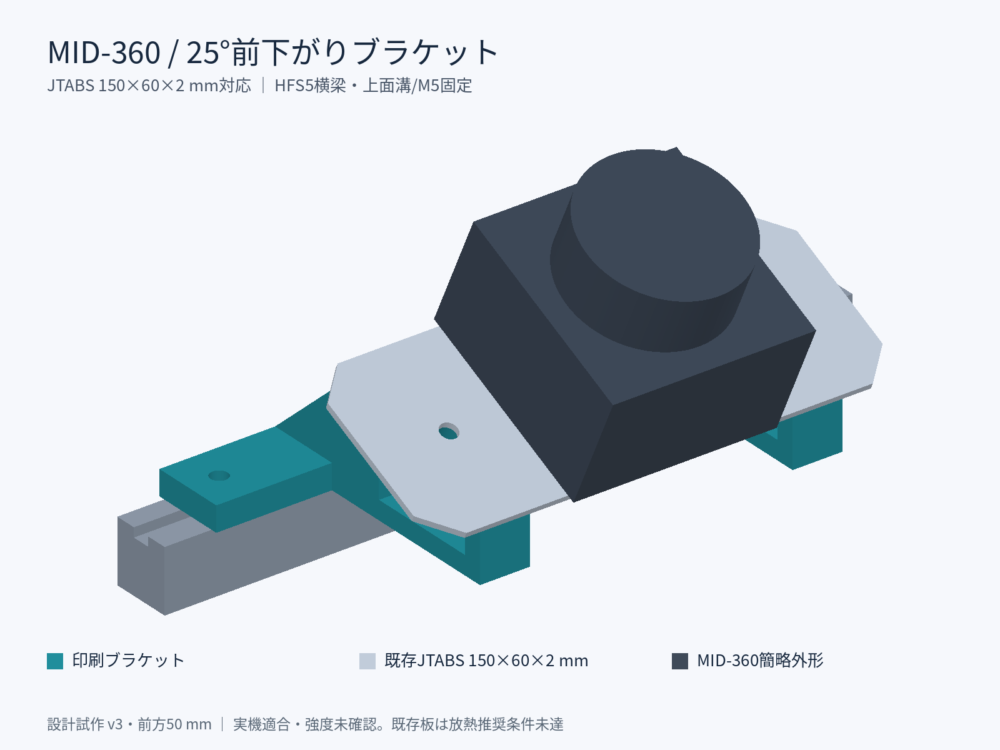
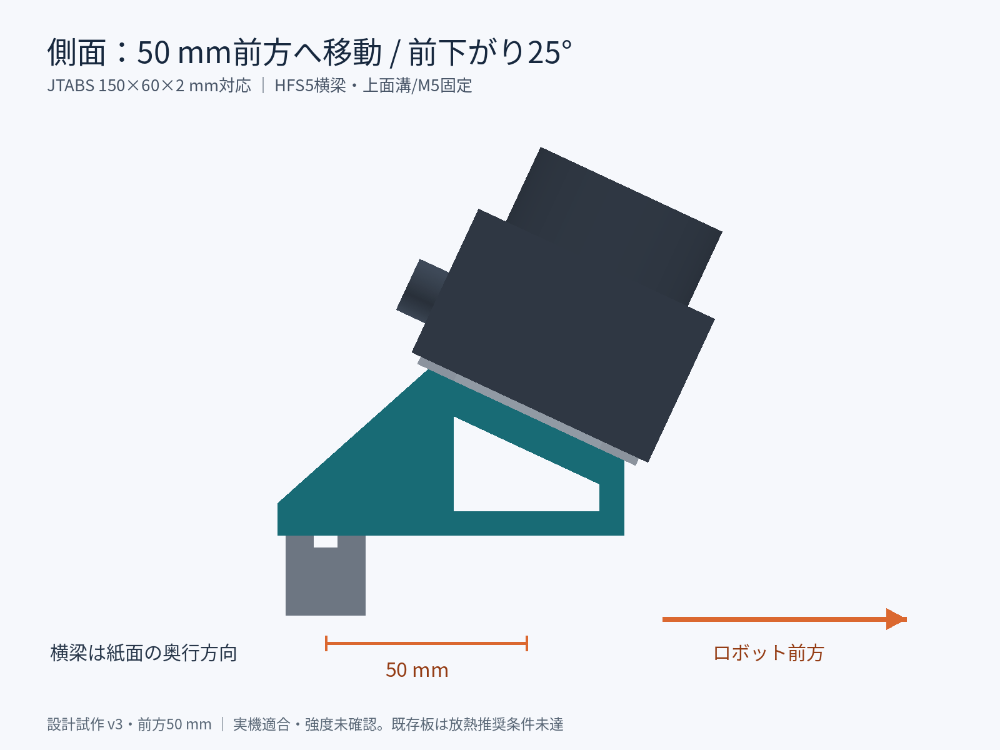
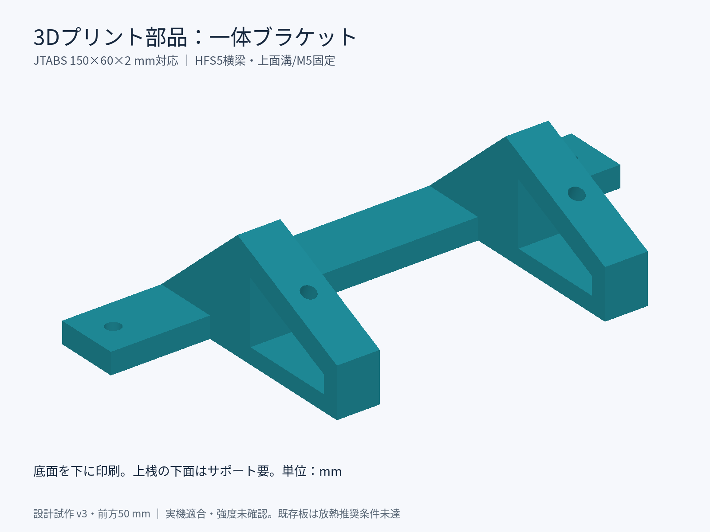
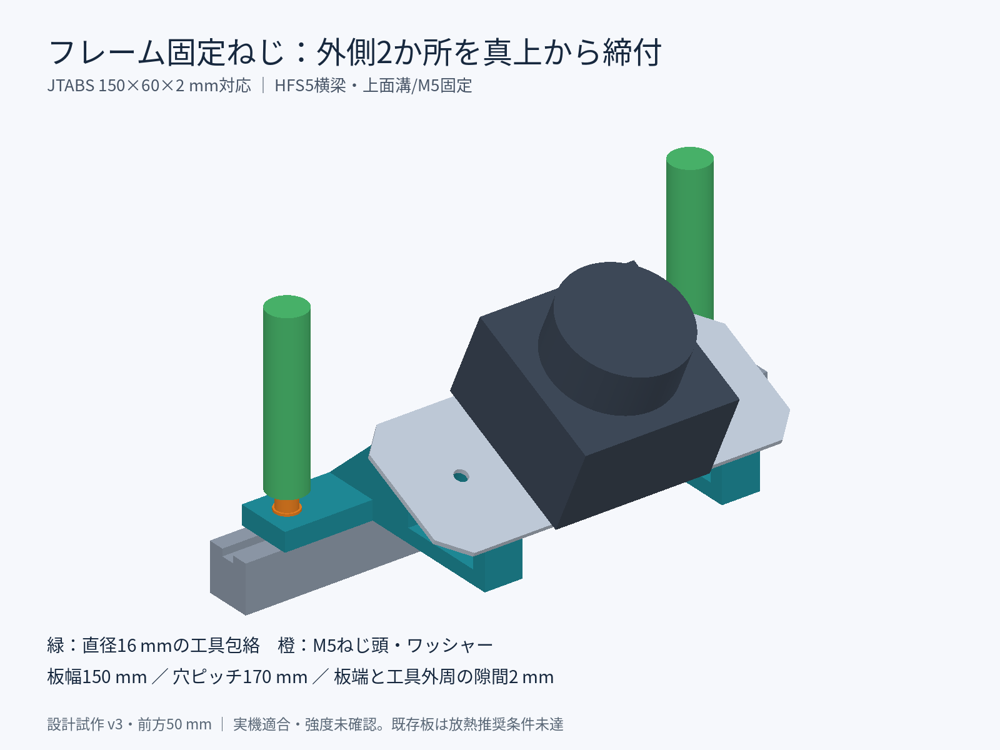

# MID-360 前下がり25°マウント — 既存MISUMI JTABS対応（前方50mm・試作v3）

指定済みの平板 **JTABS-AM-A60-B150-T2-X30-G100-N5-L6-V48-W36-NA3-CC10** を
追加穴加工せず使用し、その下に一体の3Dプリントブラケットを挟んで25°傾けます。
板の長辺をロボット横方向に向け、HFS5横梁の上面溝に固定します。
v3では横梁の固定穴を動かさず、板とセンサをv2から前方へ50mm平行移動します。
左右の支持リブを延長し、横梁中心から傾斜支持面中心までの水平距離を50mmにしています。
これはセンサ前端の張り出し量ではありません。取付角25°と支持面中心高さ30mmは維持します。
旧v1の120×140×3mm板・M4固定穴は使用しません。





## ミスミ型番の読み取り

[公式外形図・規格表](https://jp.misumi-ec.com/vona2/detail/110302701240/)を参照（2026-09-14）。
図面の横方向がA、縦方向がBです。本CADではAを前後Y、Bを横梁方向Xに割り当てています。
ミスミの寸法名Yと、本CADの前方軸Yは別物です。

| 指定 | 意味 |
| --- | --- |
| JTABS / AM | 平板、コーナーカット形状、A5052、表面処理なし |
| A60 / B150 / T2 | 前後60 × 横150 × 厚さ2mm |
| X30 / G100 / N5 | A方向30mmの位置に2穴。B方向ピッチ100mm。穴径はφ5.5 |
| Y省略 | B方向の均等配置：(150−100)/2=25mm、穴位置25・125mm |
| L6 / V48 / W36 / NA3 | A方向6・54mm、B方向ピッチ36mmの4穴。穴径はφ3.5 |
| S省略 | B方向の均等配置：(150−36)/2=57mm、穴位置57・93mm |
| CC10 | 四隅のC10面取り |

板中心を原点とした穴位置（横X, 前後Y、mm）：

- 板固定用M5通し穴：(-50, 0)、(50, 0)。
- MID-360用M3通し穴：(±18, ±24)の4点。

NA3は直径3mmでもM3タップでもなく、**直径3.5mmの通し穴**です。
MID-360底面の48×36mm取付ピッチに合わせています。
板は前後60mmなので、65mm角のセンサ底面が前後に各2.5mm張り出します。

## ファイルと寸法

物理部品の製造データをROSパッケージと分けて`hardware_parts/`に配置しています。

| exports内のファイル | 用途 |
| --- | --- |
| bracket_25deg.stl | **印刷する一体部品、1個。単位mm、原寸** |
| bracket_25deg.step | 印刷ブラケットの編集用CAD |
| misumi_jtabs_reference.step / .dxf | 指定型番を公称寸法から再構成した参照モデル。メーカー配布CADではない |
| assembly_reference.step / .stl | 組立参照。センサ・横梁は簡略外形。印刷対象外 |
| assembly.png / side.png / printed_part.png | スマートフォン確認用静止画 |
| dimensions.json | 寸法・未検証項目 |

| 印刷部品 | 寸法 |
| --- | --- |
| 外形：横×前後×高さ | 約190 × 86.47 × 41.41mm |
| 前方オフセット | 横梁中心から支持面中心まで50mm（水平距離） |
| 中央ベース | 190 × 24 × 8mm |
| 横梁への固定穴 | φ5.5、横ピッチ170mm、2穴、鉛直方向 |
| 既存板への固定穴 | φ5.5、横ピッチ100mm、2穴、傾斜面に垂直 |
| 傾斜面の中心高さ | 横梁上面から30mm |
| 側面上桟の厚さ | 傾斜面に垂直に8mm |
| 中実CAD体積 | 約88.63cm³。実際の樹脂量はスライス条件による |

CAD座標はX=横梁方向、Y=前方、Z=上。横梁上面中心が原点、支持面中心は(0, 50, 30)mm。X軸回り−25°で、前ほど低い姿勢です。
このCAD座標をROSのbase_link座標としてそのまま使わないでください。

横梁の上面幅20mm以上、上面溝に沿って170mmの固定ピッチ、横190mmの空きが必要です。
板の外側に横梁固定ねじを出して、締付工具を入れられるようにしています。
公式i-Cart mini部品表にはHFS5-2020/2040/2060とHNTT5-5が載っていますが、
実際に取り付ける横梁の型番・周辺機器との干渉は未確認です。

## 部材と組立

| 部材 | 数量 | 備考 |
| --- | --- | --- |
| 印刷ブラケット | 1 | 底面を下に印刷 |
| 指定の既存JTABS板 | 1 | 穴の追加加工不要 |
| M3×6ねじ＋厚さ0.5mm平ワッシャー | 各4 | センサ固定用候補。板から約3.5mm突出 |
| M5×20ねじ、M5ナット | 各2 | 既存板とブラケットを固定 |
| M5平ワッシャー | 4 | 上記ねじの頭側・ナット側。外径10mm程度 |
| M5×16ねじ＋平ワッシャー | 各2 | ブラケットと横梁を固定する候補 |
| HFS5対応M5 Tナット | 2 | 既存の板固定用ナットを転用可能。先入れ品は梁端から挿入 |

1. センサ底面と既存板の4穴を合わせ、板の裏からM3で固定します。
   MID-360のタップ深さは5mmです。ねじ・板・ワッシャーの実厚で突出量を測り、底付きを避けます。
   旧v1のM3×8をそのまま流用しないでください。締付トルクはメーカー仕様を優先します。
2. ブラケットの外側2穴からM5で横梁へ固定します。Tナットの噛み合いと底付きを確認します。
3. センサ付きJTABS板を傾斜面に載せ、既存N5穴2個からM5×20で固定します。
   側面窓から下側ワッシャー・ナットを入れて締めます。板は面で支持されます。
4. コネクタが後方になる向きを現物で確認し、ケーブルを別途固定して引張荷重を逃がします。
   簡略センサモデルのコネクタ位置・ケーブル曲げ半径は精密な干渉確認には使えません。

ねじ長さは候補です。現物でねじの突出、工具経路、ナットの保持を確認してください。
50mmの延長で横梁固定部に掛かる曲げモーメントが増えます。延長リブの強度・たわみは未検証です。
樹脂を潰すまで締め込まず、振動試験後に緩み・板のたわみを再確認します。

### アルミフレーム側の締付工具経路



フレーム側のねじは外側の2穴（横X=±85mm）です。板を固定する内側2穴（X=±50mm）とは別です。
既存板の端はX=±75mmなので、フレーム側のねじ中心は板端より10mm外側にあります。
上から直線状の六角レンチ・ビットを挿入して締めます。工具径16mmまでの円柱包絡では、
板端との隙間は2mmで、CAD組立形状に干渉しないことを検証しています。
図のねじ頭と工具は説明用の簡略形状で、選定済み工具の実寸モデルではありません。
太いグリップを低い位置まで差し込む工具や、L型レンチの横腕の回転範囲はこの検証に含みません。
板とセンサを載せる前にフレーム側を締める順序なら、さらに作業しやすくなります。

## 印刷と放熱上の制約

STLの底面はZ=0です。側面窓の上桟の下面には、窓から除去できるサポートを付けます。
試作開始値は積層0.2mm、外周5～6周、インフィル40～60%。強度保証値ではありません。
PETGで試作し、長期屋外用途には造形条件に応じASAやPAも検討します。PLAは避けます。

**今回の既存板はMID-360のメーカー推奨放熱条件を満たしません。**
マニュアルは厚さ3mm以上・露出面積10000mm²以上の平らな金属放熱面を推奨しています。
既存板は厚さ2mm、板全体でも9000mm²、四隅とセンサ占有面積・露出したM5穴を差し引いた
片面露出面積は概算4852mm²です。取付穴に合うことは、放熱に十分という意味ではありません。
このモデルは既存板を使う取付試作であり、放熱対策済みの屋外完成設計ではありません。
センサ周囲10mm以上の空間を確保し、連続運転温度を確認してください。
必要な場合はセンサ底面から熱を伝える金属放熱部材を別途設計します。

ソフトウェアでは単一の閉メッシュ、STEP有効性、外形、穴位置・径、部品の重なりと
M5ナット周辺の空間を検証しています。実機適合・造形・強度・疲労・放熱は未検証です。
取付後はbase_linkとセンサ間の外部姿勢を更新します。MID-360内部のLiDAR–IMU較正値は変更しません。
デジタルツインでは`lidarPitchDownDeg: 25`、Gazebo試験データ生成では
`--mid360-pitch-deg 25`を指定します。センサ高と前後位置は取付後の光学原点で測定してください。
この変更ではROS設定は自動更新しません。物理取付後に外部並進も更新してください。
設定と観測範囲の判定は[LiDAR取付角と地面観測](../../src/obstacle_route_sim/docs/LiDAR取付角と地面観測.md)を参照します。

## 再生成・検証

```bash
python3 -m venv /tmp/mid360-cad-venv
source /tmp/mid360-cad-venv/bin/activate
pip install -r hardware_parts/mid360_mount_25deg/requirements.txt
python hardware_parts/mid360_mount_25deg/build_model.py
python hardware_parts/mid360_mount_25deg/validate_model.py
```

プレビューの日本語にはNoto Sans CJKを使用します。CAD交換形式は自動生成ファイルとして扱い、
形状の変更はPythonソースと画像でレビューします。
共有先はユーザー指定待ちです。PC内の原本はiPhoneから直接取得できる共有URLではありません。

## 参照

- [MISUMI JTABS公式外形図・規格表](https://jp.misumi-ec.com/vona2/detail/110302701240/)
- [MISUMI寸法図](https://jp.misumi-ec.com/linked/item/10302701240/img/drw_01_002.gif)：緑のY・Sを省略すると均等配置
- [MISUMI CC追加工図](https://jp.misumi-ec.com/linked/item/10302701240/img/alt-d.gif)：4×CC
- [i-Cart mini公式部品表](https://t-frog.com/products/icart_mini/files/i-cart-mini_parts_list.html)
- [MID-360 User Manual](../../docs/references/mid360/Livox_Mid-360_User_Manual_EN.pdf)：印刷ページ9（PDFページ11）、取付穴と放熱条件
