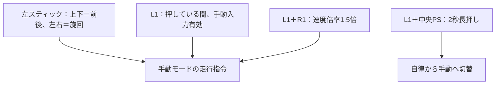

## 2026-09-22 車輪パラメータ配置

提供された `ダウンロード/icart-middle.param` を `ypspur_ros2/config/icart-middle.param`
に原文のまま格納。既定hardware設定は `package://ypspur_ros2/config/icart-middle.param`
を参照する。以下の過去記録にある「パラメータ未検出」は解消済み。

# 実機ハードウェア統合（2026-09-20）

## 2026-09-21 接続設定の更新

再起動後の追記：nkbのdialout所属とシリアル3ポートの読み書き権限を確認済み。
初回確認時の権限不足は解消した。PS3コントローラも/dev/input/js0として認識され、
隔離したROS domain 194でjoy_nodeから6軸・17ボタンのJoy受信を確認した。
hardware.yamlのdevice_nameは`Sony PLAYSTATION(R)3 Controller`へ固定し、
SDLの対応表に従いPSボタンを10へ修正（旧設定16は十字キー右）。L1は4のまま。
名前指定でのjoy_node起動も確認し、確認用ノードは終了済み。実ボタン押下の照合は未実施。
MID-360は再起動後も192.168.1.12へのping応答なし。実車用icart-middle.paramは引き続き未検出。

以下は接続後の実測結果。下記の昨年度ポート番号よりこちらを優先する。
`params/hardware.yaml` と単体GNSS設定はUSBの固定名へ更新済み。
install側の設定はソースへのsymlinkで反映される。

| 機器 | 検出ポート | 設定した固定名 |
| --- | --- | --- |
| GNSS用CH340（受信機通信は未確認） | /dev/ttyUSB0 | /dev/serial/by-id/usb-1a86_USB_Serial-if00-port0 |
| URG | /dev/ttyACM0 | /dev/serial/by-id/usb-Hokuyo_Data_Flex_for_USB_URG-Series_USB_Driver-if00 |
| 車輪 T-frog Driver | /dev/ttyACM1 | /dev/serial/by-id/usb-T-frog_project_T-frog_Driver-if00 |
| C920 | /dev/video4 | /dev/v4l/by-id/usb-046d_HD_Pro_Webcam_C920_B8DE396F-video-index0 |

シリアル機器の固定名には固有シリアル番号がないため、同型機を複数接続する場合は再確認する。
C920はYUYV・640×480・5 fps設定で1フレーム取得を確認した。
NetworkManagerに`mid360-direct`を保存・有効化し、enp0s31f6へ192.168.1.5/24を設定。
自動接続優先度100、IPv6無効、デフォルトルートは追加せず既存Wi-Fiを維持した。
有線リンクはUPになったが、192.168.1.12へのpingは3回とも応答なし。
LiDAR本体のIP・電源・接続は引き続き確認が必要。

別PCへの導入時は、PCの端末で以下を実行すると、永続的なグループ所属と
現在の3ポートへの即時アクセスを設定できる。今回のPCは再起動後に権限確認済み。

```bash
sudo usermod -aG dialout nkb
sudo setfacl -m u:nkb:rw /dev/serial/by-id/usb-1a86_USB_Serial-if00-port0 /dev/serial/by-id/usb-Hokuyo_Data_Flex_for_USB_URG-Series_USB_Driver-if00 /dev/serial/by-id/usb-T-frog_project_T-frog_Driver-if00
```

グループ所属は再ログイン後のプロセスへ反映される。ACLは現在の接続だけに有効。
実車用`/home/nkb/icart-middle.param`は未検出。車輪パラメータは推測で作成しない。
既に生成した実機sessionのhardware.yaml/um982.yamlは独立コピーなので、使う前に更新が必要。
関連する設定・launchの既存テスト9件合格。車輪ドライバの起動・走行操作は未実施。

NetworkManager設定はOS側に保存され、Gitには含まれない。別PCで再現する場合の設定例：

```bash
nmcli connection add type ethernet con-name mid360-direct ifname enp0s31f6 \
  ipv4.method manual ipv4.addresses 192.168.1.5/24 ipv4.never-default yes \
  ipv6.method disabled connection.autoconnect yes connection.autoconnect-priority 100
nmcli connection up mid360-direct
```

既存の同名接続がある場合は重複作成せず確認する。インターフェース名はPCに合わせる。
Livox SDK2の検出要求も5回送信したが応答はなく、本体IPは未確定。

## PS3コントローラ操作対応（現PC・実機用設定）

`hardware.yaml`を読み込む実機共通起動での対応。SDL対応表と処理コードを照合したもので、
各ボタンの実押下・車体の移動方向の実測は未実施。既存sessionのコピーには設定更新が必要。



| 操作部 | Joy番号 | 機能 |
| --- | --- | --- |
| 左スティック上下／左右 | axes 1／0 | 前後／旋回。通常指令最大1.2 m/s／1.5 rad/s |
| L1（左肩手前） | buttons 4 | 手動入力有効。手動中に離すと手動指令ゼロ |
| R1（右肩手前） | buttons 5 | L1併用で前後・旋回指令を1.5倍 |
| PS（中央） | buttons 10 | L1と2秒長押しで自律→手動。単独の切替機能なし |
| ×（右側の下） | buttons 0 | 経路採取開始 |
| ○（右側の右） | buttons 1 | 採取中、一時停止点を記録 |
| △（右側の上） | buttons 2 | 採取中、信号停止点を記録 |
| □（右側の左） | buttons 3 | 経路採取終了 |

通常運用では手動中にL1を離して1秒後、自律指令が新鮮なら5秒の待機を経て自律復帰する。
経路採取起動は手動固定で、自律復帰しない。自律中にL1だけを押しても手動へ切り替わらない。
○・△は経路属性を記録する操作で、押した瞬間に車体を停止する操作ではない。
PSは非常停止ではない。右スティック・十字キー・L2/R2・L3/R3・SELECT/STARTは
この操縦・採取処理では未割り当て。

## 採用構成と根拠

昨年度 [tc2025](https://github.com/t-nakabayashi/tc2025/tree/99a843c7b038de58bbaec7c33a2651849d10d18d)
の `ros1_src/launch/1_init_robot_tc2024_joystick.launch` を参照した。
今回は全てROS 2 Jazzyのドライバへ接続し、ROS 1 bridgeは不要。

| 機器 | 接続・出力 | 既定設定の根拠 |
| --- | --- | --- |
| 車輪 | YP-Spur coordinator → ypspur_ros2、/ypspur_ros/odom | /dev/ttyACM0、icart-middle.paramは昨年度 |
| URG | urg_node_driver → /scan、laser | USB /dev/ttyACM1、範囲±2 radは昨年度 |
| MID-360 | Livox CustomMsg＋IMU → FAST-LIO | /mid360/livox/lidar、/mid360/livox/imu |
| GNSS | UM982 → /rtk_gps/rtk_gps_um982_node/{fix,heading,rtk_status} | 既存UM982ドライバ。F9Pは起動しない |
| カメラ | usb_cam → /usb_cam/image_raw | 640×480、5 Hz、/dev/video0は昨年度 |
| Joy | joy_node → manual_teleop → mux | 左スティック軸1/0、L1=4、PS=16 |

MID-360のIPは現行driver同梱設定（PC 192.168.1.5、LiDAR 192.168.1.12）を初期値とする。
昨年度repoには現物IPの確証がないため、実機に接続確認済みという意味ではない。
GNSSの/dev/ttyUSB0は現行ドライバの初期値。接続後は/dev/serial/by-idの安定名に置換する。
USBカメラのYUYV形式は昨年度test_usb_cam.launchを参考とし、実機対応形式は確認する。
カメラの取付座標は資料から確定できないため、架空のカメラ外部較正・TFは追加しない。

## センサ配置

base_linkを車軸中心、x前・y左・z上とする。x=0はユーザー確認済み。
2026-09-22の静止点群から床上高さ0.562m、roll −0.6°・pitch +26.9°を採用。
高い水平面はベッドとユーザー確認済み。車輪半径0.148248mを引き、車軸上高さは0.414mとする。
現在の接地姿勢を車体水平の基準とし、x=y=0とyaw=0は既存の取り付け基準を維持する。
床・壁からx/yや車体に対するyawを新たに実測した値ではない。

| 原点 | x[m] | y[m] | z[m] | 姿勢 |
| --- | --- | --- | --- | --- |
| MID-360 LiDAR | 0 | 0 | 0.414 | roll −0.6°、pitch +26.9°（前下がり） |
| UM982メイン ANT1 | 0 | 0 | 0.564 | MID-360の鉛直上15cm（ユーザー指定） |
| UM982サブ ANT2 | -0.5 | 0 | 0.564 | メインの車体後方50cm、同じ高さ（既存値） |
| URG | 0.075 | 0 | 0.49 | 水平 |

アンテナの上15cmは傾斜したセンサz方向ではなく車体の鉛直方向。
ANT1→ANT2の方位から車体前方を求める補正は180°。UM982側で方位補正を入れた場合は二重補正しない。

FAST-LIOのLiDAR→IMU内部較正 `extrinsic_T=[-0.011,-0.02329,0.04412]`、
`extrinsic_R=I` を保持し、車体への取付角をここに加えない。オンライン外部較正は既定で無効。
車体→IMU位置は `p_BI=p_BL-R_BI*p_IL` で導出する。
融合では `R_WB=R_WI*R_BI^T`、`p_WB=p_WI-R_WB*p_BI` を使い、
車体roll/pitchからGNSS主アンテナのレバーアームを引く。
採取点群にも同じIMUの取付姿勢・位置を適用し、補正の二重適用を避ける。

融合がmap→base_linkの平面TFを配信し、各センサTFはbase_link配下。
FAST-LIO独自のcamera_init→bodyは別の局所座標系であり、bodyをbase_linkへ静的に直結しない。
公開姿勢は平面走行用で、地形追従の完全な3D車体TFではない。

## 地域・補正局の選択

`params/rtk_stations.yaml`に、地域ごとの選択肢と公開情報の確認日を保持する。
2026-09-20にcasterへ短時間接続し、次の4局全てでCRC一致のRTCM3を受信した。
受信機は接続せず、GGAによる実機位置送信もしていない。現地FIX・長時間稼働の保証ではない。

| site | station | mountpoint | 備考 |
| --- | --- | --- | --- |
| inagi | tokyo_6c10214a（既定） | 6C10214A | 既存稲城経路起点から概ね10.5km、casterはCurrent表記 |
| inagi | tokyo_c4cae992 | C4CAE992 | 概ね16.7km、casterはJGD2011_B表記 |
| tsukuba | tsukuba_takashima（既定） | 3041F3CA | つくば・高島局、casterはJGD2011_B表記 |
| tsukuba | joso_yasuda | 10D85AA2 | 常総・安田局、予備候補 |

4局とも `ntrip1.bizstation.jp:2101`、認証なしの公開ストリーム。
稲城候補の座標はcaster一覧の丸め値なので、距離は概算。
Current（今期）とJGD2011等の元期は同じ座標ではない。既存経路と基準局の座標基準は現地で照合する。
WGS84の楕円体上でENU変換する処理だけでは、元期/今期や測地成果の差を補正しない。
採取時と走行時は同じ局を使用し、局を変更するなら既知点で位置差を確認する。走行中に自動切替しない。

公開元：
- [Drogger公式の稼働確認方法](https://www.bizstation.jp/ja/drogger/man/base_confirm.html)
- [casterのsourcetable](http://ntrip1.bizstation.jp:2101/)
- [設置者が登録する善意の基準局掲示板](https://rtk.silentsystem.jp/)

旧かなめ測量つくば本社局は2025-12-22廃止、川崎西局も2023-12-25配信終了の記載があり、
既定候補から除外した。`none`（補正なし/外部補正）、`custom`（自設局・契約サービス）も選べる。
契約アカウントを作成したり、利用許可を代行取得したりはしない。

```bash
source /opt/ros/jazzy/setup.bash
source install/setup.bash
ros2 run icart_bringup check_rtk_station --site inagi --list
ros2 run icart_bringup check_rtk_station --site inagi --station tokyo_6c10214a
ros2 run icart_bringup check_rtk_station --site tsukuba --station tsukuba_takashima
```

チェックは短時間の受信のみで、シリアルポートもロボットも操作しない。
CRC一致フレーム数、RTCM種別、確認時刻を表示する。無受信時は終了コード1。
NTRIP実装はTCP分割・同一packetの先頭RTCMを保持し、SOURCETABLEを成功と誤認しない。
CRC不一致は車体へ転送せず、15秒有効RTCMが来なければ再接続する。
現時点ではNTRIP v1/plain TCP。TLSやHTTP chunked必須のサービスは非対応。

## 実機sessionの生成

初回は `params/hardware.yaml` を運用設定へコピーし、デバイス名とYP-Spur実車パラメータを記入する。
速度・軸・ボタン割当もここで変更する。生成後の複数ファイルの値を個別にずらさず、
取付・接続設定を変更したら別の新規出力先へ再生成する。

```bash
ros2 run icart_bringup prepare_real_session \
  --site inagi --station tokyo_6c10214a \
  --hardware <運用用hardware.yaml> --output <新規実機sessionディレクトリ>

ros2 run icart_bringup prepare_real_session \
  --site tsukuba --station tsukuba_takashima \
  --hardware <運用用hardware.yaml> --output <別の新規実機sessionディレクトリ>
```

出力はsession.yaml、hardware.yaml、geometry.yaml、um982.yaml、livox.json、fastlio.yaml、
fusion.yaml、recorder.yaml、projection.yaml、routes/とstation.yaml。
NTRIP設定を含むum982.yamlは0600、sessionディレクトリは0700で生成する。
`custom`では次のキーを持つ別YAMLを `--ntrip-config <ファイル>` で指定する。
`host, port, mountpoint, user, password`。認証情報はGitへ追加しない。

既定の経路は昨年度からの同梱fixed経路を引き継ぐ。現地確認済みの本番経路ではない。
古い座標系や停止属性の妥当性を自動認定しない。sessionにroute_review_requiredを記録する。
原点は経路の先頭LLH、高度未提供なら0mの計算原点とする。基準局位置を経路原点にはしない。

新しく採取・確認した経路へ切り替える場合：

```bash
ros2 run icart_bringup prepare_real_session \
  --site inagi --station tokyo_6c10214a \
  --hardware <運用用hardware.yaml> \
  --route-directory <採取した経路ディレクトリ> \
  --output <新規走行sessionディレクトリ>
```

この場合は採取先のprojection.yamlも引き継ぐ。
同じ地域でもRTK局と座標基準は採取時のstationを維持する。

## 採取・走行起動

```bash
export ROS_DOMAIN_ID=0
ros2 launch icart_bringup survey.launch.py \
  environment:=real session:=<実機session>/session.yaml \
  output:=<新規採取先> joy_input:=joy_node
```

ドライバ・位置推定・UI・Joy・記録を共通起動する。mux/joy/manual_teleopは各1個。
L1保持で操縦。ボタン0開始、1停止属性、2信号停止属性、3記録終了。
これらは速度停止ボタンではない。採取中は手動固定で、L1を離しても自律復帰しない。
外部Joy配信がある場合は `joy_input:=external` とする。

採取を停止した後、確認した経路を使うsessionへ切り替える。

```bash
ros2 run icart_bringup run_session \
  --session <走行session>/session.yaml --environment real --start-ui
```

初回はUIのmanual_start待ち。自律走行中の手動介入用Joy/manual_teleopも共通起動する。
通常の自律運用では既存のL1＋PS長押し切替・L1解放による自律復帰を維持する。
別のdrive_mode_manager.launch.pyを重ねて起動しない。
新しい実機profileは障害物ヒント未受信/1秒途絶でも自律速度をゼロにする。
手動速度は従来どおりdeadman入力であり、この自律側障害物監視を通らない。

`hardware.launch.py`はドライバだけを提供する。YP-Spur coordinator起動後2秒で車輪ノードを開始し、
ドライバ終了時は共通launchを終了する。2秒はreadyの保証ではなく、接続失敗は起動失敗として停止する。
生センサの起動だけで走行開始指令は出さない。

## 導入・検証と残る実機確認

通常の新規PCでは `rosdep install --from-paths src --ignore-src -r -y` で依存を導入する。
追加の外部依存はurg_node、usb_cam、tf2_ros。UM982・Livox・YP-Spurは既存パッケージを使う。

今回のPCではsudoの無人利用ができないため、USBカメラ依存は上流ソースからworkspaceのinstallへ通常ビルドした。
usb_cam 0.8.1とimage_commonのJazzy版（camera_info_manager / camera_calibration_parsers）を使用。
実行時のlog内ソースへのsymlink依存はない。新規PCはrosdep/aptで同等依存を導入できる。
実機センサの接続・モータ起動は行わない。公開補正局へのRTCM受信確認のみ実施する。

残る実機入力：
- `/home/nkb/icart-middle.param`が現PCに存在しない。車輪径・ギア比は推測せず、実車用ファイルが必要。
- ポートの実際の対応、アクセス権、MID-360のIP、USBカメラ形式、Joy番号は未接続のため未確認。
- MID-360高さ・姿勢と主アンテナ高さは2026-09-22更新済み。URG位置・副アンテナ間隔は既存値。
- 現地でUM982のFIX、基線長約0.5m、車体前方と補正済み方位、時刻同期を確認する。
- カメラ認識ノードは別の認識launchで起動する。今回のハードウェア起動は映像配信まで。
- 25°配置での縁石・段差検出精度や本コースの完走を保証する検証ではない。

実機パラメータ不足時は、driverプロセスを起動する前に具体的な不足をエラーにする。

## 今回のソフトウェア検証

関連回帰175件が合格。主な追加検証は、25度IMUからの車体姿勢復元、
旋回時のレバーアーム除去、傾斜点群の地面復元、実機ドライバgraph、
採取原点の引継ぎ、地域外stationの拒否、採取中手動固定、
障害物入力途絶による停止、TCP分割とCRC不一致の除去である。
ROSドライバは実機を起動せず、launch展開とビルドで確認する。
テスト実行時は環境未導入のpytest-forkedの必須指定を外した
（`python3 -m pytest -o required_plugins= ...`）。
公開局の検証ログは `log/codex/hardware_integration_20260920/rtk_verified.json`。
PC内のログ・ファイルはiPhoneから直接到達できる共有URLではない。

最終確認で変更6パッケージのsymlinkビルドとカメラ依存3パッケージの通常ビルドが成功。
全ドライバの実行ファイルとカメラの共有ライブラリ解決を確認した。
ROS_DOMAIN_ID=193の隔離模擬入力ではGNSS FIX→FLOAT→10秒欠落→FIX復帰を実際の
FusionNode/Recorderへ入力し、6 waypoint、欠落中34融合観測・2 waypoint・信号停止を保存して合格した。
この追加通信試験は従来の水平取付による回帰で、25度配置は別の幾何・点群テストで検証した。
両地域のprepare_real_session CLIを実行し、経路・投影・取付設定の生成に成功。
実機preflightは不足中のicart-middle.paramを検出し、ドライバ未起動で停止することを確認した。

### カメラの安定デバイス名（2026-09-22修正）

`camera.device`には`/dev/v4l/by-id/…-video-index0`を保持し、実機launchで起動時にリンクを解決してusb_camへ渡す。usb_camが相対リンク先を`/dev/../../video4`と誤解決する問題を回避する。`/dev/video4`のような番号を設定へ固定しない。指定デバイスがない場合は起動時にエラーとし、別カメラへ自動切替しない。

### FAST-LIO範囲設定（2026-09-22）

近距離除外`preprocess.blind=0.7`m、局所地図`cube_side_length=2000.0`mを採用。
MID360既定設定および現在の`log/real_inagi_mount_20260922/fastlio.yaml`に反映。
新規実機sessionはMID360既定設定を引き継ぐ。過去の試験sessionは変更しない。

[2026公式課題](https://tsukubachallenge.jp/2026/regulations/tasks)は約2.2km。
保存済み参考経路`src/route_planner/routes/tsukuba2026_digital_twin/fixed/waypoints.csv`
（1142点）の概算水平範囲は東西560m・南北262m、最大点間距離577m。
経路上の任意地点から初期化し、任意の水平yawでも、移動量は577m以下。
局所地図の半幅1000mからこの移動量を引いた423mは、
実装の地図移動閾値`1.5*det_range=150m`を上回る。
従って参考経路全体を初期局所地図内に保持できる余裕がある。
地理モデルは図上トレースで現地測量値ではなく、未知エリアの詳細・推定ドリフトや
コース変更を保証するものではない。走行経路そのものは変更しない。

`det_range=100m`、0.5mボクセル、累積地図の表示1秒・記録10秒は維持。
局所地図は自己位置推定の検索用点群で、`/Laser_map`の累積表示地図とは別。
一辺の拡大は密な立方格子の一括確保ではないが、保持する点が増えればメモリ負荷も増える。
