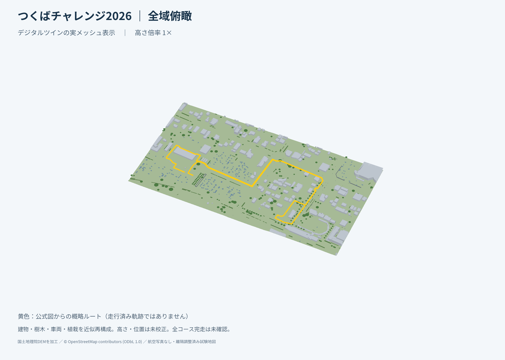

# クローンに同梱するつくば2026デジタルツイン

全周約2.224 km、約809 × 434 mの固定試験地図を同梱する。
左右1 mの離隔を確保するため物体を移動・削除した調整版であり、現地測量地図ではない。
GNSS/LIO・URG・経路追従の確認に使う。現地通行可否や完走を保証しない。

## クローン直後に地図を見る

`preview.html` をWebGL対応ブラウザで開く。地形・建物・樹木・車両候補・経路と
Three.jsを埋め込んであり、HTTPサーバー、npm、地図サービスへのアクセスは不要。
表示操作は回転・拡大・レイヤー切替と市役所／駅周辺への視点切替。

- [全域俯瞰](views/01_full.png)
- [市役所・開始終了付近](views/02_cityhall.png)
- [接続道路](views/03_connection.png)
- [北側沿道](views/04_hotel.png)
- [駅周辺](views/05_station.png)



iPhoneからPC内ファイルには直接アクセスできない。上記PNGは軽量な閲覧版である。
HTMLをiPhoneへ渡すにはアクセス可能な共有先が必要で、HTML実行可否は閲覧アプリにも依存する。
このパッケージは公開サーバーや共有URLを作成しない。

## シミュレーションを起動する

Ubuntu 24.04・ROS 2 Jazzy・Gazebo Harmonic・Qt WebEngineとワークスペース依存を
ルートREADMEに従って導入し、再帰cloneしておく。OS依存や実行用バイナリは同梱しない。
ワークスペースルートでROS環境とvenvを有効にして実行する。

```bash
colcon build --symlink-install --packages-up-to icart_bringup
source install/setup.bash
ros2 run icart_bringup run_digital_twin --output log/digital_twin/session01 --start-ui
```

起動コマンドが同梱地図を展開し、模擬GNSS・LIO・融合・経路・運行UIを起動する。
UIの開始操作までは停止待ち。UIから起動済みの共通スタックを重複起動しない。
停止は起動端末のCtrl+C。既存出力先は上書きしないので、再試験は別の保存先を指定する。
作成済み設定を再利用する場合は次を使う。

```bash
ros2 run icart_bringup run_session --session log/digital_twin/session01/session.yaml --environment simulation --start-ui
```

既定DDS domainは86。並行試験は `run_digital_twin --domain-id 87` など別番号にする。
`run_digital_twin` はsimulation専用で、実機ドライバを起動する引数は提供しない。

地図展開だけならROSや地図生成用Python依存は不要（Python 3.11以上）。

```bash
python3 src/icart_bringup/icart_bringup/digital_twin_core.py --output log/digital_twin/check --prepare-only
```

## 固定内容

| ファイル | 用途 |
| --- | --- |
| `world.tar.gz` | 完成済み地形・衝突メッシュ・IMU追加済みworld・1,142点のLLH経路・session設定 |
| `manifest.json` | archiveと全展開ファイルのSHA-256・サイズ |
| `preview.html` | 地図とThree.jsを埋め込んだオフライン3D表示 |
| `views/` | 同じ地図から描画した静止画像5枚 |
| `THREE-LICENSE` | Three.js r128のMITライセンス |

archiveは通常のGit blobとして追跡する。Git LFSや別途ダウンロードは不要。
展開時はSHA-256を照合し、絶対パス・親参照・symlink・不足ファイルを拒否する。
session内の地図・経路参照はすべて展開先からの相対パス。
圧縮地図は約11.3 MB。閲覧版・静止画像を合わせた同梱容量は約17 MBである。

## 出典・データ利用条件

- 建物・街路・樹木等：© OpenStreetMap contributors。
  本ディレクトリの地図データベース（worldの形状・属性・その加工物）は
  [Open Database License 1.0](https://opendatacommons.org/licenses/odbl/1-0/)で提供する。
  [OSM著作権表記](https://www.openstreetmap.org/copyright)を参照。
- 地形：国土地理院のDEMタイルを加工して作成した。
  原URL・ハッシュはarchiveの `world/trial.json` の `dem_sources` に保持する。
  [国土地理院コンテンツ利用規約](https://www.gsi.go.jp/kikakuchousei/kikakuchousei40182.html)に従う。
- 概略経路：つくばチャレンジ2026公式コース図を参照した図上トレース。
  [経路README](../../../route_planner/routes/tsukuba2026_digital_twin/README.md)を参照。
- 車両・植栽等の位置候補は従来の写真解析結果を保持する。
  解析時の写真出典は Esri, Vantor, Earthstar Geographics, GIS User Community。
  航空写真タイル・画像・写真テクスチャ自体はこの同梱版に含めない。
  地面の表示は無地とし、LiDARと衝突に使うメッシュ座標は保持する。

## 地図を更新する場合

`tools/bundle_digital_twin.py` に確認済みtrial・world・viewer原本・経路を指定し、
新規出力ディレクトリに固定版を生成する。通常起動にはこのツールを使わない。
更新時には本README、manifest、閲覧版、静止画像も合わせて更新する。
`tools/render_full_course_views.py --no-photo` で写真を使わない静止画像を作成できる。

## 検証範囲（2026-09-14）

- ワークスペースのpytestは565件成功。archiveの破損・親参照・symlink拒否を含む。
- obstacle_route_sim・icart_bringup・robot_consoleは通常／symlink両installでビルド成功。
- 同梱地図の起動試験はDDS domain 88で45秒実行した。LiDAR 377件、GNSS 185件、
  LIO位置135件、融合位置136件を受信し、最終状態はGPS_LIOだった。
  開始前の速度指令はゼロを維持し、終了通知後にQt・Gazeboを含む起動群が正常終了した。
- 閲覧版は外部画像・script参照がないことと埋め込みJavaScriptの構文を検査した。
  静止画像は全域と4局所を用意した。ブラウザでの操作とiPhone実機表示は未検証。
- 全周走行、実地精度、実機の動作はこの固定版の起動検証の対象外とする。
