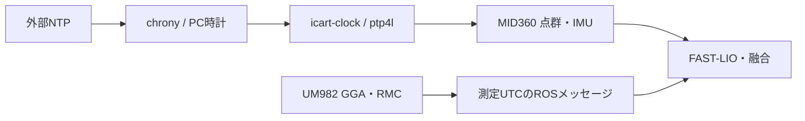

# PC・GNSS・MID360の時刻同期と確認手順

## 構成

PCはchronyで外部NTPに同期し、icart-clock.serviceがPCの時刻をsoftware PTPでMID360へ配信する。
GNSSは受信機が送るGGAの測定時分秒とRMCの日付からUTCを構成し、ROSメッセージへ付ける。
USB到着時刻を測定時刻に置き換えない。GNSSのRMCはchrony SOCKへ渡すが、noselectのためPCの同期元には使わない。



| 接続・設定 | 値 |
|---|---|
| LiDAR専用NIC | enp0s31f6 |
| PCのLiDAR側IP | 192.168.1.5 |
| MID360 IP | 192.168.1.201 |
| PTP | UDPv4、E2E、domain 0、two-step、software timestamp |
| PTP互換形式 | ptp_minor_version 0 |
| GNSS | stamp_source=gnss_utc、transport_delay_ms=0、time_sync.enabled=true |
| chrony SOCK | /run/chrony/um982.sock、UM98、noselect |
| 状態ファイル | /run/icart-clock/status.json |

PTPマスターはPCで、ptp4lはPC時計を補正しない。phc2sysは使わない。
専用LANに別のPTPマスターを置かない。GNSSのシリアルを開くノードは1つにする。

## 自動処理とGUI操作

1. PC起動でchronyとicart-clockサービスが自動起動する。
2. ネット未接続なら同期待ち。NetworkManagerの接続通知でchronyが時刻源のオンライン状態を更新する。
3. NTPの品質条件と有線リンクが成立すると、PCからPTPを自動配信する。ここまでGUI操作は不要。
4. GUIの「実機」または「実機（融合）」でモード・場所・経路などを選び「一斉起動」する。
5. GNSS・LiDARドライバを起動し、点群・IMUの同期成立を待つ。
6. 同期成立後、車輪ドライバ・FAST-LIO・融合・走行制御を起動する。走行は別の開始操作で行う。

LiDARが取得を開始した後でもPTPへ同期できる。同期前の取得済みデータの時刻は遡って修正されない。
そのため、共通起動では同期成立までFAST-LIO・融合・走行系を起動しない。

GUIの手動プリセットはreal_survey→survey→bringup、自律プリセットはrecorded_route→bringupを通る。
対象はhardware_configを持つ共通実機起動。シミュレーションや個別ノードの診断起動にはゲートを適用しない。

## 同期ゲート

| 対象 | 条件 |
|---|---|
| NTP時刻源 | 外部サーバが選択済み（^*）、直近応答成功、Leap status=Normal |
| NTP鮮度 | 2ポーリング周期以内。下限16秒、上限256秒 |
| PC残補正 | 絶対値5 ms以下 |
| NTP推定誤差上限 | 絶対残補正＋root delay/2＋root dispersionが20 ms以下 |
| 点群・IMU | 両方time_type=1、直近5秒内に4秒以上の継続データ |
| 受信継続 | 最新受信から0.2秒以内、受信間隔の最大0.2秒以下 |
| パケット時刻 | カーネル受信時刻との差が−1〜10 ms |
| 逆行 | 過去最大時刻から0.1 ms以下は許容してminor_backwardsへ記録。それ以上は10秒抑止 |
| GUI起動側の状態確認 | clock_source=ntp、同じboot ID、状態更新から3秒以内 |

微小逆行を繰り返しても、過去最大時刻からの差で大きな逆行を検出する。
センサデータのタイムスタンプそのものは書き換えない。
起動待ちは最大180秒。未成立なら起動を中止し、同期後に利用者が一斉起動し直す。
運用中のゲート失効は共通スタックのshutdownを要求する。
NTP条件喪失でPTP配信を停止し、条件が戻ると配信を自動再開する。走行系は利用者が再起動する。
ネットワーク断の検出はNTPのポーリング・応答状態に依存し、切断直後とは限らない。

## GUI警告

PyQt5 GUIの実機モードでは、同期未成立時に全タブ上部へ警告を表示する。1秒周期で状態を確認する。
NTP未成立、PTP配信待ち、点群・IMUの同期待ち、状態ファイルの欠落・更新停止を表示する。
一度同期が成立した後の異常は「時刻同期が失われました」と表示し、正常復帰で警告を消す。
シミュレーションでは表示しない。警告表示は状態の読み取りだけを行い、時計や走行指令を変更しない。
GUIコード更新の反映にはGUIの再起動が必要。

## 初回導入

走行・位置推定プロセスを停止した状態で、ワークスペースから実行する。
設定の適用には管理者権限が必要。ROSノードとGUIは一般ユーザーで起動する。

```bash
source install/setup.bash
ros2 run rtk_gps_um982 prepare_clock_host --user nkb --output log/clock_setup
sudo bash log/clock_setup/apply-host.sh
sudo bash src/rtk_gps_um982/tools/install_clock_service.sh enp0s31f6 192.168.1.201
```

prepare_clock_hostの出力先は新規ディレクトリを指定する。
apply-hostはchrony設定と権限を準備し、makestepを無効化して時計をslewで補正する。
install_clock_serviceは設定を退避し、RMCをnoselectに設定し、サービスを登録・起動する。
第2引数を省略した場合もLiDAR IPは192.168.1.201となる。
以後の通常起動にsudoやPTPの手動起動は不要。

SOCKのアクセス権はchronyの起動時に付与する。RuntimeDirectoryMode=0750と特権ExecStartPostを使用する。
PTP管理ソケットは/run/icart-clockに置く。UFW有効時は専用NIC・LiDAR IPのUDP 319/320を許可する。
このPCではNetworkManagerのchrony dispatcherがネット接続変化時にchronyc onofflineを実行する。

## ロボットを動かさない確認

```bash
systemctl is-enabled chrony icart-clock
systemctl is-active chrony icart-clock
chronyc -n sources
chronyc tracking
cat /run/icart-clock/status.json
```

サービスのactiveだけで同期成立とは判断しない。NTPの^*と状態ファイルのready=trueを確認する。
gnss_clock_ready=falseはNTP運用で正常。precision_verified=falseは絶対精度を独立検証していないことを示す。

センサのみ必要な場合は、生成済み実機sessionを指定する。

```bash
ros2 launch icart_bringup clock_sensors.launch.py session_directory:=/path/to/session
```

このlaunchは車輪や融合を起動しない。既存GNSS/Livoxノードとの二重起動を避ける。
生パケット監視はAF_PACKETで行い、ROSドライバのUDP受信ポートを占有しない。

## 精度と確認範囲

NTPの推定誤差上限は上流時計の正しさを仮定する。受信差にはセンサの生成・伝送遅延を含む。
readyは運用条件の成立を示すもので、絶対時刻精度の保証ではない。
GNSSと融合の間は測定時刻順に処理し、0.35秒のバッファとLIO内挿で到着の遅れを扱う。

実機でNTP基準のPTP配信、点群・IMUの同期種別、GNSS測定UTC保持、サービス配置を確認済み。
GUI警告の未成立・喪失・復帰・模擬時非表示は自動試験で確認済み。
GUIからの全実機起動・走行、ネットワーク断を伴う長時間運用、独立基準による絶対精度は未検証。

## 参照

- [全体構成](../../../docs/GNSS_FASTLIO時刻同期提案.md)
- [共通起動設計](../../icart_bringup/docs/共通起動設計.md)
- [chronyの監視値](https://chrony-project.org/doc/4.4/chronyc.html)
- [LinuxPTP](https://www.linuxptp.org/documentation/ptp4l/)
- [Livox時刻同期](https://livox-wiki-en.readthedocs.io/en/latest/tutorials/new_product/common/time_sync.html)
